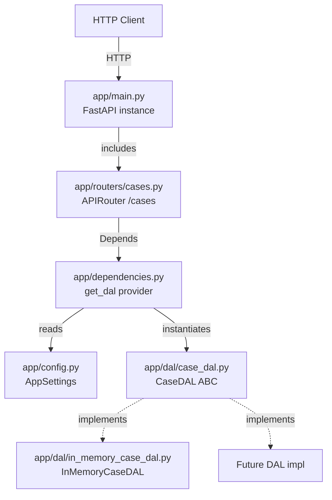

# Design Document: Case API

## Overview

The Case API is a RESTful HTTP service built with FastAPI that exposes full CRUD operations for support cases. It delegates data persistence to an abstract Data Access Layer (DAL) resolved at runtime through Inversion of Control (IoC). The design prioritises testability, extensibility, and consistent error handling.

The system introduces four new modules on top of the existing model and DAL layers:

1. **Configuration** (`app/config.py`) — Pydantic BaseSettings class that reads the DAL implementation choice from the environment.
2. **Dependency injection** (`app/dependencies.py`) — A DAL registry and a `get_dal` provider function wired via FastAPI's `Depends`.
3. **Router** (`app/routers/cases.py`) — Endpoint definitions for `/cases` resource.
4. **Application entry point** (`app/main.py`) — FastAPI app instance, router registration, and root health-check.

## Architecture



**Request flow:**

1. Client sends HTTP request to `/cases/...`.
2. FastAPI routes to the matching handler in `cases.py`.
3. The handler declares `dal: CaseDAL = Depends(get_dal)`.
4. `get_dal` reads `AppSettings.dal_implementation`, looks up the DAL registry, and returns an instance.
5. The handler calls DAL methods, transforms the result, and returns an HTTP response.
6. Exceptions raised by the DAL are caught by handler-level try/except blocks and mapped to the appropriate HTTP error response.

## Components and Interfaces

### New Files

| File | Purpose |
|------|---------|
| `app/main.py` | FastAPI app instance, router registration, root `/` health-check |
| `app/config.py` | `AppSettings(BaseSettings)` — reads `DAL_IMPLEMENTATION` env var |
| `app/dependencies.py` | DAL registry dict, `get_dal()` provider function |
| `app/routers/__init__.py` | Package marker |
| `app/routers/cases.py` | All `/cases` CRUD endpoint handlers |
| `app/models/requests.py` | `CreateCaseRequest`, `UpdateCaseRequest` Pydantic models |
| `app/models/errors.py` | `ErrorResponse` Pydantic model |

### app/config.py

```python
from pydantic_settings import BaseSettings


class AppSettings(BaseSettings):
    dal_implementation: str = "InMemoryCaseDAL"

    class Config:
        env_prefix = ""
        case_sensitive = False


def get_settings() -> AppSettings:
    return AppSettings()
```

### app/dependencies.py

```python
from typing import Type
from app.dal.case_dal import CaseDAL
from app.dal.in_memory_case_dal import InMemoryCaseDAL
from app.config import get_settings

# Registry: string identifier → concrete CaseDAL subclass
DAL_REGISTRY: dict[str, Type[CaseDAL]] = {
    "InMemoryCaseDAL": InMemoryCaseDAL,
}


def get_dal() -> CaseDAL:
    settings = get_settings()
    dal_name = settings.dal_implementation
    if dal_name not in DAL_REGISTRY:
        raise ValueError(
            f"Unrecognized DAL implementation: '{dal_name}'. "
            f"Registered: {list(DAL_REGISTRY.keys())}"
        )
    return DAL_REGISTRY[dal_name]()
```

### app/routers/cases.py (Interface)

```python
@router.post("/", status_code=201, response_model=CaseModel, summary="...", description="...")
def create_case(body: CreateCaseRequest, dal: CaseDAL = Depends(get_dal)) -> CaseModel: ...

@router.get("/", response_model=list[CaseModel], summary="...", description="...")
def get_all_cases(dal: CaseDAL = Depends(get_dal)) -> list[CaseModel]: ...

@router.get("/{case_id}", response_model=CaseModel, summary="...", description="...")
def get_case_by_id(case_id: uuid.UUID, dal: CaseDAL = Depends(get_dal)) -> CaseModel: ...

@router.put("/{case_id}", response_model=CaseModel, summary="...", description="...")
def update_case(case_id: uuid.UUID, body: UpdateCaseRequest, dal: CaseDAL = Depends(get_dal)) -> CaseModel: ...

@router.delete("/{case_id}", status_code=204, summary="...", description="...")
def delete_case(case_id: uuid.UUID, dal: CaseDAL = Depends(get_dal)) -> None: ...
```

### app/main.py

```python
from fastapi import FastAPI
from app.routers import cases

app = FastAPI(title="Case API", version="1.0.0")
app.include_router(cases.router, prefix="/cases", tags=["cases"])

@app.get("/", summary="Health check", description="Returns API status")
def root():
    return {"status": "ok"}
```

## Data Models

### Existing: CaseModel (app/models/case.py)

Already defined — UUID case_id, email (max 254, pattern validated), issue (1–2000 chars), response (max 5000 chars), severity (literal enum).

### CreateCaseRequest (app/models/requests.py)

```python
class CreateCaseRequest(BaseModel):
    email: str = Field(..., max_length=254, pattern=r"^[^@]+@[^@]+$")
    issue: str = Field(..., min_length=1, max_length=2000)
    response: str = Field(default="", max_length=5000)
    severity: Literal["low", "medium", "high", "critical"]
```

- Excludes `case_id` — the server generates it.
- `response` defaults to empty string (optional on creation).

### UpdateCaseRequest (app/models/requests.py)

```python
class UpdateCaseRequest(BaseModel):
    email: str = Field(..., max_length=254, pattern=r"^[^@]+@[^@]+$")
    issue: str = Field(..., min_length=1, max_length=2000)
    response: str = Field(..., max_length=5000)
    severity: Literal["low", "medium", "high", "critical"]
```

- All fields required (full replacement semantics).
- Excludes `case_id` — taken from path parameter.

### ErrorResponse (app/models/errors.py)

```python
class ErrorResponse(BaseModel):
    detail: str = Field(..., max_length=500)
```

Single-field model used as the response body for all 4xx/5xx responses.

## Correctness Properties

*A property is a characteristic or behavior that should hold true across all valid executions of a system — essentially, a formal statement about what the system should do. Properties serve as the bridge between human-readable specifications and machine-verifiable correctness guarantees.*

### Property 1: Create-then-retrieve round-trip

*For any* valid CreateCaseRequest, POSTing it to `/cases` and then GETting `/cases/{case_id}` using the returned case_id SHALL produce a response whose email, issue, response, and severity fields are identical to the original request.

**Validates: Requirements 3.1, 5.1**

### Property 2: Validation rejection without DAL invocation

*For any* request body that violates the field constraints of CreateCaseRequest or UpdateCaseRequest (email exceeds 254 chars, issue empty or exceeds 2000 chars, response exceeds 5000 chars, severity not in allowed set, or missing required fields), the API SHALL return HTTP 422 and the DAL SHALL NOT be invoked.

**Validates: Requirements 3.2, 6.3, 9.3, 9.5**

### Property 3: Get-all completeness invariant

*For any* sequence of N create operations (each with distinct case_id, no deletions), GET `/cases` SHALL return exactly N items, and the set of case_ids in the response SHALL equal the set of case_ids generated during creation.

**Validates: Requirements 4.1, 4.2**

### Property 4: Update-then-retrieve round-trip

*For any* existing case and *for any* valid UpdateCaseRequest, PUTting to `/cases/{case_id}` and then GETting `/cases/{case_id}` SHALL produce a response whose email, issue, response, and severity match the update request body.

**Validates: Requirements 6.1**

### Property 5: Non-existent ID yields 404

*For any* UUID that does not correspond to an existing case, GET `/cases/{uuid}`, PUT `/cases/{uuid}`, and DELETE `/cases/{uuid}` SHALL all return HTTP 404 with an ErrorResponse body containing the unrecognized case_id in the detail message.

**Validates: Requirements 5.2, 6.2, 7.2**

### Property 6: Delete-then-retrieve yields 404

*For any* case that has been successfully created and then deleted (receiving HTTP 204), a subsequent GET `/cases/{case_id}` SHALL return HTTP 404 and GET `/cases` SHALL NOT include that case_id.

**Validates: Requirements 7.1, 7.5**

### Property 7: Request model field constraint equivalence

*For any* dictionary of field values, if the dictionary is accepted by CaseModel (ignoring case_id), then it SHALL also be accepted by CreateCaseRequest (with response defaulting) and UpdateCaseRequest — and vice versa: if rejected by CaseModel for a shared field constraint, the request models SHALL also reject it.

**Validates: Requirements 9.1, 9.2, 9.3**

### Property 8: Error sanitization

*For any* unexpected exception type raised by the DAL (i.e., not KeyError, ValueError, or TypeError), the API SHALL return HTTP 500 with an ErrorResponse whose detail field is a fixed generic message and does NOT contain stack traces, file paths, or variable names from the exception.

**Validates: Requirements 10.3**

### Property 9: Error responses use JSON content-type

*For any* API request that results in an HTTP 4xx or 5xx response, the response Content-Type header SHALL be `application/json`.

**Validates: Requirements 10.6**

## Error Handling

Each route handler wraps DAL calls in a try/except chain that maps exceptions to HTTP responses:

| DAL Exception | HTTP Status | Detail content |
|---------------|-------------|----------------|
| `KeyError` | 404 | `"Case with case_id={id} not found"` |
| `ValueError` | 400 | Exception message (capped at 500 chars) |
| `TypeError` | 422 | Exception message (capped at 500 chars) |
| Any other `Exception` | 500 | `"An internal error occurred"` (fixed) |

**Design decisions:**

1. **No global exception handler.** Each router endpoint handles its own exceptions so that error messages can include context (e.g., which case_id was not found). This keeps responses specific and informative while avoiding a catch-all that might mask bugs during development.
2. **Fixed 500 message.** Internal errors never leak implementation details. The detail is always the literal string `"An internal error occurred"`.
3. **Validation errors (422) are handled by FastAPI/Pydantic** automatically before the handler body executes, so the DAL is never invoked for malformed requests.
4. **ErrorResponse model** is declared as the `response_model` for 404/422/500 responses in the OpenAPI schema, giving consumers a predictable error shape.

## Testing Strategy

### Dual Testing Approach

The testing strategy uses both unit tests (example-based) and property-based tests (universal properties) via **pytest** and **Hypothesis**.

### Property-Based Tests (Hypothesis)

PBT is appropriate here because:
- The API has pure-functional logic (validation, field mapping, CRUD round-trips) that varies meaningfully with input.
- The input space is large (email strings, issue text 1–2000 chars, severity enum, UUIDs).
- Universal properties hold across all valid inputs (round-trips, invariants, error mapping).

**Library:** `hypothesis` (already in requirements.txt)
**Test client:** `fastapi.testclient.TestClient` (synchronous, no server needed)
**Minimum iterations:** 100 per property (`@settings(max_examples=100)`)
**Tag format:** `# Feature: case-api, Property {N}: {title}`

Each correctness property above maps to one property-based test function:

| Property | Test file | Strategy |
|----------|-----------|----------|
| 1: Create-then-retrieve | `tests/routers/test_cases_properties.py` | Generate valid CreateCaseRequest dicts, POST, then GET by returned ID |
| 2: Validation rejection | `tests/routers/test_cases_properties.py` | Generate invalid field values, POST/PUT, assert 422, assert DAL mock not called |
| 3: Get-all completeness | `tests/routers/test_cases_properties.py` | Generate N valid cases, POST all, GET /cases, assert count and IDs match |
| 4: Update-then-retrieve | `tests/routers/test_cases_properties.py` | Create case, generate valid update body, PUT, then GET and compare |
| 5: Non-existent ID 404 | `tests/routers/test_cases_properties.py` | Generate random UUIDs, attempt GET/PUT/DELETE, assert 404 |
| 6: Delete-then-retrieve | `tests/routers/test_cases_properties.py` | Create case, DELETE, then GET and assert 404 |
| 7: Constraint equivalence | `tests/models/test_request_models_properties.py` | Generate field dicts, validate against both CaseModel and request models, assert agreement |
| 8: Error sanitization | `tests/routers/test_cases_properties.py` | Mock DAL to raise RuntimeError/OSError/etc., assert 500 with fixed message |
| 9: Error content-type | `tests/routers/test_cases_properties.py` | Trigger various errors, assert Content-Type header |

### Unit Tests (Example-Based)

Unit tests cover:
- Smoke tests: app instance exists, router registered, `/` returns 200, docs endpoints available
- DI configuration: default DAL, invalid DAL name raises error, custom DAL registration
- Specific error scenarios: DAL raises KeyError → 404, ValueError → 400, TypeError → 422
- Edge cases: empty store returns `[]`, invalid UUID path parameter returns 422

**Test structure** mirrors `app/`:
```
tests/
├── routers/
│   ├── __init__.py
│   ├── test_cases.py              # Example-based unit tests
│   └── test_cases_properties.py   # Property-based tests (Properties 1-6, 8-9)
├── models/
│   ├── test_request_models.py     # Example-based model tests
│   └── test_request_models_properties.py  # Property-based (Property 7)
├── test_config.py                 # Config/DI tests
└── test_main.py                   # App bootstrap smoke tests
```

### Dependencies Required

The following packages need to be added to `requirements.txt`:
- `fastapi==0.115.0`
- `pydantic==2.9.2`
- `pydantic-settings==2.5.2`
- `uvicorn==0.30.6`
- `httpx==0.27.2` (for TestClient)
- `pytest==8.3.3`

(`hypothesis==6.112.2` is already present.)
