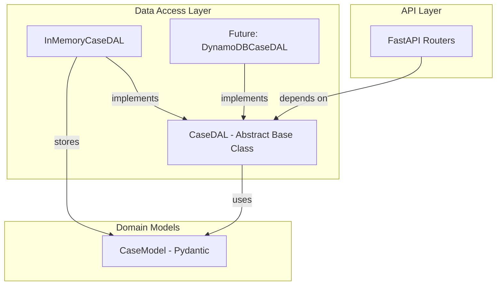
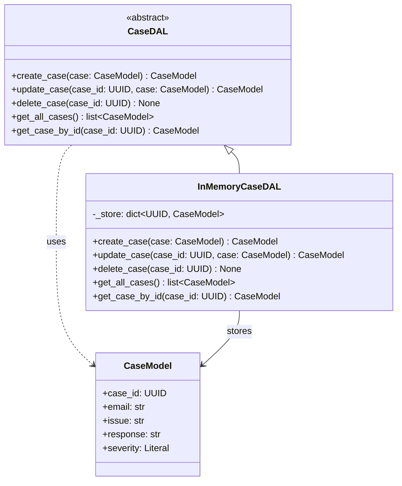

# Design Document: Case Data Access Layer (CaseDAL)

## Overview

The Case Data Access Layer (CaseDAL) provides an abstract interface that encapsulates all persistence operations for support cases. By depending on an abstract base class rather than concrete storage, routers and services remain decoupled from the underlying database technology. This design enables:

- Swapping backends (in-memory, DynamoDB, PostgreSQL) without touching route handlers
- Testability via a lightweight in-memory implementation
- Consistent error semantics regardless of which backend is active

The DAL lives in `app/dal/` and exposes five operations: create, update, delete, get all, and get by ID.

## Architecture



**Layered Architecture:**

1. **Router Layer** — HTTP concerns only; delegates all data operations to DAL via dependency injection.
2. **DAL Layer** — Defines the abstract contract (`CaseDAL`) and concrete implementations. Raises domain-level exceptions (`ValueError`, `KeyError`, `TypeError`).
3. **Model Layer** — Pydantic models defining the data shape. Shared between routers and DAL.

The router layer depends on the DAL abstraction (not a concrete class). FastAPI's dependency injection system provides the active implementation at runtime.

## Components and Interfaces

### CaseDAL (Abstract Base Class)

```python
import abc
import uuid
from app.models.case import CaseModel


class CaseDAL(abc.ABC):
    """Abstract base class defining the contract for case data access."""

    @abc.abstractmethod
    def create_case(self, case: CaseModel) -> CaseModel:
        """Persist a new case to the store.

        Args:
            case: A valid CaseModel instance to persist.

        Returns:
            The persisted CaseModel (field values identical to input).

        Raises:
            ValueError: If a case with the same case_id already exists.
        """
        ...

    @abc.abstractmethod
    def update_case(self, case_id: uuid.UUID, case: CaseModel) -> CaseModel:
        """Replace an existing case in the store.

        Args:
            case_id: UUID of the case to update.
            case: The new CaseModel data to store.

        Returns:
            The updated CaseModel (field values identical to input).

        Raises:
            KeyError: If no case with the given case_id exists.
            ValueError: If case_id is None/invalid or case is None.
        """
        ...

    @abc.abstractmethod
    def delete_case(self, case_id: uuid.UUID) -> None:
        """Remove a case from the store.

        Args:
            case_id: UUID of the case to delete.

        Raises:
            KeyError: If no case with the given case_id exists.
            ValueError: If case_id is None or not a valid UUID.
        """
        ...

    @abc.abstractmethod
    def get_all_cases(self) -> list[CaseModel]:
        """Retrieve all cases from the store.

        Returns:
            A list of all CaseModel instances. Empty list if store is empty.
        """
        ...

    @abc.abstractmethod
    def get_case_by_id(self, case_id: uuid.UUID) -> CaseModel:
        """Retrieve a single case by its identifier.

        Args:
            case_id: UUID of the case to retrieve.

        Returns:
            The matching CaseModel instance.

        Raises:
            KeyError: If no case with the given case_id exists.
            TypeError: If case_id is None or not a valid uuid.UUID.
        """
        ...
```

### InMemoryCaseDAL (Concrete Implementation for Testing)

```python
import uuid
from app.models.case import CaseModel
from app.dal.case_dal import CaseDAL


class InMemoryCaseDAL(CaseDAL):
    """In-memory implementation of CaseDAL backed by a dictionary.

    Intended for unit/property testing. Not suitable for production use.
    """

    def __init__(self) -> None:
        self._store: dict[uuid.UUID, CaseModel] = {}

    def create_case(self, case: CaseModel) -> CaseModel:
        if case.case_id in self._store:
            raise ValueError(f"Case with case_id={case.case_id} already exists")
        self._store[case.case_id] = case
        return case

    def update_case(self, case_id: uuid.UUID, case: CaseModel) -> CaseModel:
        if case_id is None:
            raise ValueError("case_id must not be None")
        if case is None:
            raise ValueError("case must not be None")
        if not isinstance(case_id, uuid.UUID):
            raise ValueError(f"case_id must be a valid uuid.UUID, got {type(case_id)}")
        if case_id not in self._store:
            raise KeyError(case_id)
        self._store[case_id] = case
        return case

    def delete_case(self, case_id: uuid.UUID) -> None:
        if case_id is None or not isinstance(case_id, uuid.UUID):
            raise ValueError("case_id must be a valid uuid.UUID")
        if case_id not in self._store:
            raise KeyError(case_id)
        del self._store[case_id]

    def get_all_cases(self) -> list[CaseModel]:
        return list(self._store.values())

    def get_case_by_id(self, case_id: uuid.UUID) -> CaseModel:
        if case_id is None or not isinstance(case_id, uuid.UUID):
            raise TypeError(f"case_id must be a uuid.UUID, got {type(case_id)}")
        if case_id not in self._store:
            raise KeyError(case_id)
        return self._store[case_id]
```

### Class Diagram



## Data Models

### CaseModel (existing — no changes)

| Field      | Type                                       | Constraints                     |
|------------|--------------------------------------------|---------------------------------|
| `case_id`  | `uuid.UUID`                                | Required, RFC 4122 UUID         |
| `email`    | `str`                                      | Max 254 chars, `^[^@]+@[^@]+$`  |
| `issue`    | `str`                                      | 1–2000 chars                    |
| `response` | `str`                                      | Max 5000 chars                  |
| `severity` | `Literal["low","medium","high","critical"]` | Required                        |

### Internal Store (InMemoryCaseDAL)

| Structure                      | Description                                      |
|-------------------------------|--------------------------------------------------|
| `dict[uuid.UUID, CaseModel]` | Maps `case_id` to its `CaseModel` instance.      |

No new persistence schema is introduced. The abstract class is storage-agnostic — each concrete implementation defines its own storage format.

### Module Layout

```
app/
├── dal/
│   ├── __init__.py          # Exports: CaseDAL, InMemoryCaseDAL
│   └── case_dal.py          # CaseDAL ABC + InMemoryCaseDAL
├── models/
│   ├── __init__.py
│   └── case.py              # CaseModel (unchanged)
└── ...

tests/
├── dal/
│   ├── __init__.py
│   ├── test_case_dal.py           # Unit tests for InMemoryCaseDAL
│   └── test_case_dal_properties.py # Property-based tests
└── ...
```


## Correctness Properties

*A property is a characteristic or behavior that should hold true across all valid executions of a system — essentially, a formal statement about what the system should do. Properties serve as the bridge between human-readable specifications and machine-verifiable correctness guarantees.*

### Property 1: Create-then-retrieve round-trip

*For any* valid `CaseModel` instance, creating it via `create_case` and then retrieving it via `get_case_by_id` with the same `case_id` SHALL return a `CaseModel` with every field value exactly equal to the original input — no fields added, removed, or mutated.

**Validates: Requirements 2.1, 2.3, 6.1, 6.4**

### Property 2: Duplicate create rejection preserves store

*For any* `CaseModel` already persisted in the store, calling `create_case` with a `CaseModel` having the same `case_id` SHALL raise a `ValueError`, and the originally stored case SHALL remain unchanged (retrieving by that `case_id` returns the original, unmodified case).

**Validates: Requirements 2.2**

### Property 3: Update replaces stored value

*For any* `case_id` that exists in the store and *any* valid replacement `CaseModel`, calling `update_case` SHALL cause a subsequent `get_case_by_id` to return a `CaseModel` with field values equal to the replacement, and the return value of `update_case` itself SHALL equal the replacement.

**Validates: Requirements 3.1, 3.3**

### Property 4: Delete removes case from store

*For any* store containing at least one case, deleting an existing case via `delete_case` SHALL (a) decrease the length of `get_all_cases` by exactly one, and (b) cause a subsequent `get_case_by_id` with the same `case_id` to raise `KeyError`.

**Validates: Requirements 4.1, 4.3, 4.5**

### Property 5: Non-existent ID operations raise KeyError

*For any* `uuid.UUID` that is not present in the store, calling `get_case_by_id`, `update_case`, or `delete_case` with that UUID SHALL raise a `KeyError` whose argument is the provided UUID.

**Validates: Requirements 1.9, 1.10, 3.2, 4.2, 6.2**

### Property 6: get_all_cases count invariant

*For any* sequence of `n` successful `create_case` calls with distinct `case_id` values (and no deletions), `get_all_cases` SHALL return a list of length exactly `n`, where every created case appears in the result.

**Validates: Requirements 5.1, 5.3**

## Error Handling

### Error Contract Summary

| Method           | Error Type     | Condition                                    |
|------------------|----------------|----------------------------------------------|
| `create_case`    | `ValueError`   | Duplicate `case_id` already in store         |
| `update_case`    | `KeyError`     | `case_id` not found in store                 |
| `update_case`    | `ValueError`   | `case_id` is None/invalid or `case` is None  |
| `delete_case`    | `KeyError`     | `case_id` not found in store                 |
| `delete_case`    | `ValueError`   | `case_id` is None or not a valid UUID        |
| `get_case_by_id` | `KeyError`     | `case_id` not found in store                 |
| `get_case_by_id` | `TypeError`    | `case_id` is None or not a valid `uuid.UUID` |

### Design Rationale

- **`ValueError`** — Used for logical violations the caller can prevent (duplicate creates, None arguments, invalid input).
- **`KeyError`** — Used for "not found" semantics, consistent with Python's dict interface and easily mapped to HTTP 404 at the router layer.
- **`TypeError`** — Used exclusively in `get_case_by_id` for type-level violations (wrong argument type), distinguishing "wrong type" from "valid type but not found."

### Error Handling Strategy

1. **Validate inputs early** — Check for None/invalid types before store lookup to provide clear error messages.
2. **Raise domain exceptions** — The DAL raises standard Python exceptions (`ValueError`, `KeyError`, `TypeError`), not HTTP exceptions. The router layer maps these to HTTP status codes.
3. **Preserve store integrity** — On error, the store state remains unchanged (no partial writes).
4. **Include identifiers in messages** — Error messages include the offending `case_id` value for debuggability.

## Testing Strategy

### Property-Based Testing (Hypothesis)

The project already uses `hypothesis==6.112.2`. Property tests will validate the six correctness properties defined above.

**Configuration:**
- Minimum 100 examples per property test (Hypothesis default `max_examples=100`)
- Each test tagged with a comment referencing the design property
- Tag format: `# Feature: case-dal, Property {N}: {title}`

**Generators:**
- Reuse the existing `valid_case_dict` strategy from `tests/models/test_case_properties.py`
- Add a `valid_case_model` strategy that builds `CaseModel` instances directly
- Add a `distinct_case_models` strategy for generating lists of cases with unique `case_id` values

**Test file:** `tests/dal/test_case_dal_properties.py`

### Unit Tests (pytest)

Example-based tests for specific scenarios and edge cases not covered by properties:

- ABC enforcement: incomplete subclass raises `TypeError` on instantiation
- Empty store: `get_all_cases` returns `[]`
- `update_case` with `case=None` raises `ValueError`
- `update_case` with invalid `case_id` type raises `ValueError`
- `delete_case` with `None` raises `ValueError`
- `get_case_by_id` with `None` raises `TypeError`
- `get_case_by_id` with non-UUID type raises `TypeError`
- Module structure: `from app.dal import CaseDAL` succeeds
- No router/HTTP imports in `case_dal.py`

**Test file:** `tests/dal/test_case_dal.py`

### Test Balance

- **Property tests** handle comprehensive input coverage (random valid CaseModels, random UUIDs, random store states)
- **Unit tests** handle structural checks (ABC enforcement, module exports, import isolation) and specific error-condition edge cases (None inputs, wrong types)
- Together they provide full coverage of all 7 requirements and their acceptance criteria
