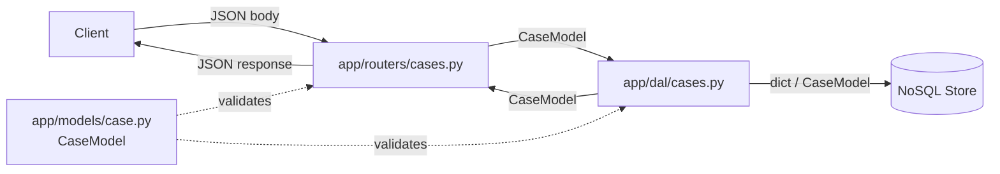

# Design Document: CaseModel

## Overview

`CaseModel` is the central Pydantic data model for a support case in the kiro-api system. It acts as the single source of truth for the shape, validation rules, and serialization contract of a support ticket. Every layer of the application — API routers, the data access layer (DAL), and OpenAPI documentation — consumes this model directly.

The design goal is to define the model once, enforce all constraints at the Pydantic layer, and let FastAPI and the DAL rely on that contract without duplicating validation logic.

---

## Architecture

`CaseModel` is a pure Pydantic model with no runtime side effects. It sits at the boundary between:

- **Inbound HTTP requests** — FastAPI deserializes request bodies into `CaseModel` (or a request-specific sub-model that shares its field definitions).
- **Outbound HTTP responses** — FastAPI serializes `CaseModel` instances to JSON for responses.
- **The DAL** — The DAL receives and returns `CaseModel` instances (or plain dicts produced by `model_dump()`), keeping all database code type-safe and validated.



**Key architectural decisions:**

1. `CaseModel` is defined in `app/models/case.py` and imported wherever a support case needs to be handled.
2. `severity` is typed as a `Literal["low", "medium", "high", "critical"]` rather than an `Enum` — this keeps the serialized form as a plain string (no `.value` unwrapping needed) and produces a clean `enum` array in the OpenAPI schema without extra boilerplate.
3. All field constraints (`max_length`, `pattern`) are expressed via `pydantic.Field()` and `Annotated` so they appear in the generated JSON schema and OpenAPI docs automatically.
4. `case_id` uses `uuid.UUID` natively; Pydantic coerces string representations to `UUID` on input and serializes back to `UUID` on `model_dump()`.

---

## Components and Interfaces

### `app/models/case.py`

This is the only new file introduced by this feature.

```python
import uuid
from typing import Literal
from pydantic import BaseModel, Field


class CaseModel(BaseModel):
    case_id: uuid.UUID = Field(
        ...,
        description="Unique identifier for the support case (RFC 4122 UUID).",
        examples=["550e8400-e29b-41d4-a716-446655440000"],
    )
    email: str = Field(
        ...,
        max_length=254,
        pattern=r"^[^@]+@[^@]+$",
        description="Email address of the user who submitted the case (RFC 5321, max 254 chars).",
        examples=["user@example.com"],
    )
    issue: str = Field(
        ...,
        min_length=1,
        max_length=2000,
        description="Description of the problem reported by the user (1–2000 characters).",
        examples=["The dashboard fails to load after login."],
    )
    response: str = Field(
        ...,
        max_length=5000,
        description="Support team reply or resolution for the case (max 5000 characters).",
        examples=["We have identified the issue and deployed a fix in v2.3.1."],
    )
    severity: Literal["low", "medium", "high", "critical"] = Field(
        ...,
        description="Urgency/impact level of the case.",
        examples=["high"],
    )
```

**Interface contract:**

| Method | Input | Output | Notes |
|---|---|---|---|
| `CaseModel(**kwargs)` | Keyword field values | `CaseModel` instance | Raises `ValidationError` on constraint violation |
| `CaseModel.model_validate(data)` | `dict` or JSON-compatible mapping | `CaseModel` instance | Coerces types (e.g., string → `UUID`) |
| `instance.model_dump()` | — | `dict` with 5 keys; `case_id` as `uuid.UUID` | Used by DAL for persistence |
| `instance.model_dump(mode="json")` | — | `dict` with `case_id` as `str` | Used for JSON serialization |
| `CaseModel.model_json_schema()` | — | JSON Schema `dict` | Used by FastAPI for OpenAPI docs |

### Integration with Routers (`app/routers/cases.py`)

Routers use `CaseModel` as the request body type and response model:

```python
@router.post("/cases", response_model=CaseModel, status_code=201)
async def create_case(case: CaseModel):
    return await dal.create_case(case)
```

FastAPI automatically validates the incoming JSON against `CaseModel` and returns a 422 response on validation failure — no extra error-handling code needed in the router.

### Integration with DAL (`app/dal/cases.py`)

The DAL receives and returns `CaseModel` instances. It uses `model_dump()` to convert to a plain dict for the NoSQL driver and `model_validate()` to reconstruct instances from stored dicts:

```python
async def create_case(case: CaseModel) -> CaseModel:
    data = case.model_dump()          # dict with uuid.UUID object for case_id
    await db.collection.insert_one(data)
    return case

async def get_case(case_id: uuid.UUID) -> CaseModel:
    data = await db.collection.find_one({"case_id": case_id})
    return CaseModel.model_validate(data)
```

---

## Data Models

### `CaseModel` field specification

| Field | Python type | Constraints | Pydantic mechanism |
|---|---|---|---|
| `case_id` | `uuid.UUID` | Must be a valid RFC 4122 UUID | Native `UUID` type coercion |
| `email` | `str` | Non-empty; exactly one `@` with non-empty local and domain parts; max 254 chars | `max_length=254`, `pattern=r"^[^@]+@[^@]+$"` |
| `issue` | `str` | Non-empty; max 2000 chars | `min_length=1`, `max_length=2000` |
| `response` | `str` | Max 5000 chars | `max_length=5000` |
| `severity` | `Literal["low","medium","high","critical"]` | Must be one of four values | `Literal` type annotation |

### Severity type decision

Using `Literal["low", "medium", "high", "critical"]` instead of a `str` `Enum`:

- **Pro**: Serializes to/from plain strings natively with no `.value` access needed.
- **Pro**: OpenAPI schema shows `enum: ["low","medium","high","critical"]` directly.
- **Con**: No `.name`/`.value` semantics — acceptable since severity is treated as a plain string throughout the codebase.

If ordered comparisons between severity levels are needed in future (e.g., `severity >= "high"`), the type can be migrated to `enum.Enum` with integer values, which is a backward-compatible change at the API level since the serialized form remains the same string.

### JSON schema output (representative)

```json
{
  "properties": {
    "case_id": {
      "type": "string",
      "format": "uuid",
      "description": "Unique identifier for the support case (RFC 4122 UUID).",
      "examples": ["550e8400-e29b-41d4-a716-446655440000"]
    },
    "email": {
      "type": "string",
      "maxLength": 254,
      "pattern": "^[^@]+@[^@]+$",
      "description": "Email address of the user who submitted the case (RFC 5321, max 254 chars).",
      "examples": ["user@example.com"]
    },
    "issue": {
      "type": "string",
      "minLength": 1,
      "maxLength": 2000,
      "description": "Description of the problem reported by the user (1–2000 characters).",
      "examples": ["The dashboard fails to load after login."]
    },
    "response": {
      "type": "string",
      "maxLength": 5000,
      "description": "Support team reply or resolution for the case (max 5000 characters).",
      "examples": ["We have identified the issue and deployed a fix in v2.3.1."]
    },
    "severity": {
      "enum": ["low", "medium", "high", "critical"],
      "description": "Urgency/impact level of the case.",
      "examples": ["high"]
    }
  },
  "required": ["case_id", "email", "issue", "response", "severity"]
}
```

---

## Correctness Properties

*A property is a characteristic or behavior that should hold true across all valid executions of a system — essentially, a formal statement about what the system should do. Properties serve as the bridge between human-readable specifications and machine-verifiable correctness guarantees.*

### Property 1: Round-trip serialization

*For any* valid `CaseModel` instance `m`, calling `CaseModel.model_validate(m.model_dump())` SHALL produce an instance where every field value is equal to the corresponding field value of `m`.

**Validates: Requirements 3.1, 3.4**

---

### Property 2: Valid construction succeeds for all valid inputs

*For any* combination of a valid UUID, a well-formed email (non-empty, contains exactly one `@` with non-empty parts on both sides, max 254 chars), a non-empty issue string up to 2000 characters, a response string up to 5000 characters, and a severity value from `{"low","medium","high","critical"}`, constructing a `CaseModel` SHALL succeed without raising any exception.

**Validates: Requirements 2.6**

---

### Property 3: Invalid UUID is rejected

*For any* string that is not a valid RFC 4122 UUID representation, constructing a `CaseModel` with that string as `case_id` SHALL raise a `pydantic.ValidationError`.

**Validates: Requirements 2.1**

---

### Property 4: Invalid email format is rejected

*For any* string that does not contain exactly one `@` character separating a non-empty local part and a non-empty domain part, constructing a `CaseModel` with that string as `email` SHALL raise a `pydantic.ValidationError`.

**Validates: Requirements 2.2, 2.3**

---

### Property 5: Field length constraints are enforced

*For any* string whose length exceeds the declared maximum for a given field (`email` > 254, `issue` > 2000, `response` > 5000), constructing a `CaseModel` with that string in the corresponding field SHALL raise a `pydantic.ValidationError`. Conversely, *for any* string at or below the limit that satisfies all other constraints, construction SHALL succeed.

**Validates: Requirements 1.3, 1.4, 1.5**

---

### Property 6: Invalid severity is rejected

*For any* string not in `{"low", "medium", "high", "critical"}`, constructing a `CaseModel` with that string as `severity` SHALL raise a `pydantic.ValidationError`.

**Validates: Requirements 2.5**

---

### Property 7: None or absent required field is rejected

*For any* valid case dict, setting any single required field (`case_id`, `email`, `issue`, `response`, or `severity`) to `None` and calling `CaseModel.model_validate()` SHALL raise a `pydantic.ValidationError`.

**Validates: Requirements 2.7**

---

### Property 8: Schema metadata completeness

*For every* field in `CaseModel.model_fields`, the field SHALL have a non-empty `description` string and at least one concrete `example` value that itself satisfies the field's own validation constraints.

**Validates: Requirements 4.2, 4.3, 4.4**

---

## Error Handling

`CaseModel` delegates all error handling to Pydantic. There is no custom error-handling code in the model itself.

**Validation errors:** Pydantic raises `pydantic.ValidationError` on any constraint violation. FastAPI catches this automatically and returns an HTTP 422 Unprocessable Entity response with a structured JSON body listing all violations. No router-level try/except is needed for field validation.

**Type coercion vs. strict mode:** By default, Pydantic v2 coerces compatible types (e.g., a UUID string is coerced to `uuid.UUID`). The model does not use `model_config = ConfigDict(strict=True)` so that callers can pass UUID strings (common from JSON deserialization) without pre-conversion.

**Missing fields:** If any required field is absent from the input dict, Pydantic raises `ValidationError` with a `missing` error type for each absent field.

**Downstream error propagation:** The DAL is expected to receive only validated `CaseModel` instances. If the DAL calls `model_validate()` on data retrieved from the database and that data fails validation (e.g., due to data corruption or a schema migration), a `ValidationError` will propagate up and should be caught at the router level and translated to an HTTP 500 response.

---

## Testing Strategy

### Unit tests (`tests/models/test_case.py`)

Unit tests cover specific examples and edge cases using `pytest`:

- **Construction success**: Instantiate with known-good values; assert no exception.
- **Construction failure examples**: Empty email, email without `@`, email with two `@`, issue that is empty string, unknown severity string, UUID string in wrong format.
- **`model_dump()` structure**: Assert the returned dict has exactly the 5 expected keys and `case_id` is `uuid.UUID`.
- **`model_json_schema()` metadata**: Assert each field's schema entry contains both `"description"` and `"examples"`.

### Property-based tests (`tests/models/test_case_properties.py`)

Use **[Hypothesis](https://hypothesis.readthedocs.io/)** (the standard Python PBT library) to verify the correctness properties above.

Each property test runs a **minimum of 100 iterations** (Hypothesis default; increase with `settings(max_examples=200)` for coverage-sensitive properties).

Each test is tagged with a comment referencing its design property:

```python
# Feature: case-model, Property 1: Round-trip serialization
```

**Generator strategy:**

```python
from hypothesis import given, settings, strategies as st
import uuid

# Strategy for valid severity values
valid_severity = st.sampled_from(["low", "medium", "high", "critical"])

# Strategy for valid emails (non-empty local@domain, max 254 chars)
valid_email = st.from_regex(r"[a-z0-9]{1,64}@[a-z]{1,63}\.[a-z]{2,10}", fullmatch=True).filter(lambda e: len(e) <= 254)

# Strategy for valid UUIDs
valid_uuid = st.uuids()

# Strategy for a complete valid CaseModel dict
valid_case_dict = st.fixed_dictionaries({
    "case_id": valid_uuid,
    "email": valid_email,
    "issue": st.text(min_size=1, max_size=2000),
    "response": st.text(max_size=5000),
    "severity": valid_severity,
})
```

**Property test outline (one function per property):**

- **P1 — Round-trip**: `@given(valid_case_dict)` → construct, dump, validate, assert field equality.
- **P2 — Valid construction**: `@given(valid_case_dict)` → assert construction does not raise.
- **P3 — Invalid UUID**: `@given(st.text().filter(lambda s: not is_valid_uuid(s)))` → assert `ValidationError`.
- **P4 — Invalid email**: `@given(st.text().filter(lambda s: s.count("@") != 1 or ...))` → assert `ValidationError`.
- **P5 — Length constraints**: `@given(st.text(min_size=255, max_size=300))` for email, etc. → assert `ValidationError` for each over-limit field.
- **P6 — Invalid severity**: `@given(st.text().filter(lambda s: s not in {"low","medium","high","critical"}))` → assert `ValidationError`.
- **P7 — None field rejected**: `@given(valid_case_dict, st.sampled_from(["case_id","email","issue","response","severity"]))` → set field to `None`, assert `ValidationError`.
- **P8 — Schema metadata**: Single `@given` over `st.just(CaseModel.model_fields.items())` or a simple loop — assert all fields have non-empty description and a valid example.

### Test configuration

Hypothesis must be added to `requirements.txt` (pinned):

```
hypothesis==6.112.2
```

No watch mode — run tests with:

```
venv\Scripts\pytest tests/models/
```
