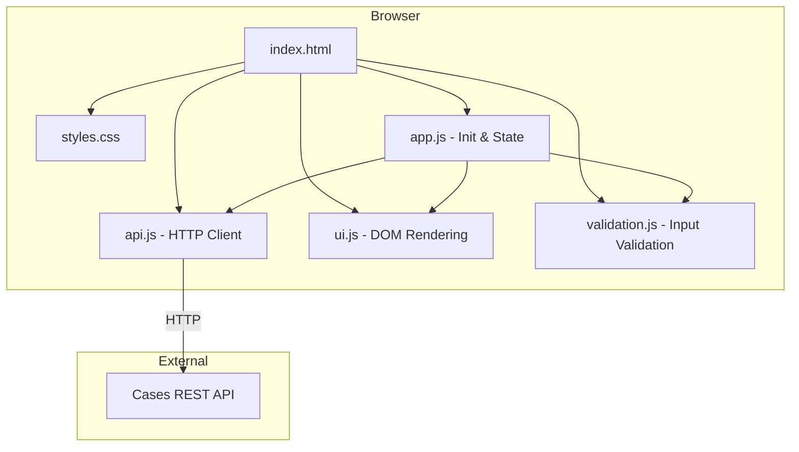

# Design Document: Cases Web UI

## Overview

The Cases Web UI is a lightweight, framework-free browser application that provides CRUD operations for support cases by consuming the existing FastAPI Cases REST API. It lives in `webui/` at the repository root and consists of plain HTML, CSS, and JavaScript files that can be served by any static file server or opened directly in a browser.

The UI provides:
- A configurable API base URL (persisted in localStorage)
- A list view showing all cases with severity badges
- Create/edit forms with client-side validation
- Delete with confirmation
- Comprehensive error handling and loading states
- Accessibility via semantic HTML and ARIA

### Design Decisions

1. **No framework**: Plain JS with DOM APIs keeps the bundle at zero bytes, avoids build tooling, and matches the requirement for no transpilation or package manager.
2. **Single-page structure**: All views render into sections of `index.html`. Navigation between list and form is handled by showing/hiding containers — no client-side router needed for this scope.
3. **Module pattern**: JavaScript is split into focused modules loaded via `<script>` tags (not ES modules, to support `file://` protocol without CORS issues).
4. **localStorage for config**: The API URL persists across sessions without any server-side state.

## Architecture



### Data Flow

1. **Page load**: `app.js` initializes by reading the API URL from localStorage (or using default), then calls `api.js` to fetch all cases, then calls `ui.js` to render the list.
2. **User actions** (create, edit, delete): `app.js` orchestrates validation via `validation.js`, API calls via `api.js`, and UI updates via `ui.js`.
3. **Config change**: User edits the URL in the settings section, `validation.js` validates it, `app.js` persists to localStorage and updates the `api.js` base URL reference.

## Components and Interfaces

### File Structure

```
webui/
├── index.html          # Entry point, HTML structure, script/style references
├── styles.css          # All styling including severity colours, form states
├── js/
│   ├── app.js          # Application controller — init, state, event wiring
│   ├── api.js          # HTTP client — all fetch calls to Cases API
│   ├── ui.js           # DOM manipulation — rendering lists, forms, messages
│   └── validation.js   # Pure validation functions — URL, email, form fields
```

### api.js — HTTP Client

```javascript
/**
 * Sets the API base URL used for all subsequent requests.
 * @param {string} url - Base URL (e.g., "http://localhost:8000")
 */
function setApiBaseUrl(url) { /* ... */ }

/**
 * Fetches all cases from GET /cases/.
 * @returns {Promise<{ok: boolean, data?: Array, error?: string, status?: number}>}
 */
async function getAllCases() { /* ... */ }

/**
 * Creates a new case via POST /cases/.
 * @param {{email: string, issue: string, response: string, severity: string}} caseData
 * @returns {Promise<{ok: boolean, data?: object, error?: string, status?: number}>}
 */
async function createCase(caseData) { /* ... */ }

/**
 * Updates an existing case via PUT /cases/{caseId}.
 * @param {string} caseId - UUID of the case to update
 * @param {{email: string, issue: string, response: string, severity: string}} caseData
 * @returns {Promise<{ok: boolean, data?: object, error?: string, status?: number}>}
 */
async function updateCase(caseId, caseData) { /* ... */ }

/**
 * Deletes a case via DELETE /cases/{caseId}.
 * @param {string} caseId - UUID of the case to delete
 * @returns {Promise<{ok: boolean, error?: string, status?: number}>}
 */
async function deleteCase(caseId) { /* ... */ }
```

All functions use a 10-second `AbortController` timeout. Return shape is always `{ok, data?, error?, status?}` for uniform handling.

### validation.js — Pure Validation Functions

```javascript
/**
 * Validates an API base URL.
 * @param {string} url
 * @returns {{valid: boolean, error?: string}}
 */
function validateApiUrl(url) { /* ... */ }

/**
 * Validates an email address (contains exactly one @ with non-empty parts).
 * @param {string} email
 * @returns {{valid: boolean, error?: string}}
 */
function validateEmail(email) { /* ... */ }

/**
 * Validates the full case form data.
 * @param {{email: string, issue: string, severity: string, response?: string}} data
 * @returns {{valid: boolean, errors: Record<string, string>}}
 */
function validateCaseForm(data) { /* ... */ }

/**
 * Truncates a string to maxLen characters, appending "..." if truncated.
 * @param {string} text
 * @param {number} maxLen
 * @returns {string}
 */
function truncateText(text, maxLen) { /* ... */ }
```

### ui.js — DOM Rendering

Responsible for:
- Rendering the case list table/cards with severity badges
- Showing/hiding the create and edit forms
- Displaying success/error messages via ARIA live regions
- Managing loading indicators
- Managing focus for accessibility

### app.js — Application Controller

Responsible for:
- Initializing the app (read config, wire events, load cases)
- Coordinating between validation, API, and UI modules
- Managing application state (current view, selected case for editing)
- Button disable/enable during in-flight requests

## Data Models

### Case (JavaScript representation)

```javascript
/**
 * @typedef {Object} Case
 * @property {string} case_id - UUID v4
 * @property {string} email - Max 254 chars, must contain @
 * @property {string} issue - 1-2000 chars
 * @property {string} response - 0-5000 chars
 * @property {"low"|"medium"|"high"|"critical"} severity
 */
```

### API Request/Response Shapes

| Operation | Method | Path | Request Body | Success Response |
|-----------|--------|------|--------------|-----------------|
| List | GET | /cases/ | — | `Case[]` (200) |
| Create | POST | /cases/ | `{email, issue, response?, severity}` | `Case` (201) |
| Get | GET | /cases/{id} | — | `Case` (200) |
| Update | PUT | /cases/{id} | `{email, issue, response, severity}` | `Case` (200) |
| Delete | DELETE | /cases/{id} | — | (204 No Content) |

### localStorage Schema

| Key | Value | Purpose |
|-----|-------|---------|
| `cases_webui_api_url` | String URL | Persisted API base URL |

## Correctness Properties

*A property is a characteristic or behavior that should hold true across all valid executions of a system — essentially, a formal statement about what the system should do. Properties serve as the bridge between human-readable specifications and machine-verifiable correctness guarantees.*

### Property 1: API URL validation correctness

*For any* string, `validateApiUrl` SHALL return `{valid: true}` if and only if the string begins with `http://` or `https://` and has length <= 2048 characters. For all other strings, it SHALL return `{valid: false}` with an error message.

**Validates: Requirements 2.1, 2.5**

### Property 2: Email validation correctness

*For any* string, `validateEmail` SHALL return `{valid: true}` if and only if the string contains exactly one `@` character where both the local part (before `@`) and the domain part (after `@`) are non-empty. For all other strings, it SHALL return `{valid: false}`.

**Validates: Requirements 4.7**

### Property 3: Text truncation correctness

*For any* string and positive integer `maxLen`: if the string's length is <= `maxLen`, `truncateText(text, maxLen)` SHALL return the original string unchanged. If the string's length is > `maxLen`, `truncateText(text, maxLen)` SHALL return a string of exactly `maxLen + 3` characters whose first `maxLen` characters equal the input's first `maxLen` characters, followed by `"..."`.

**Validates: Requirements 3.2**

### Property 4: Form validation completeness

*For any* form data object where at least one of email, issue, or severity is empty or missing, `validateCaseForm` SHALL return `{valid: false}` with an error keyed to each invalid/missing required field. *For any* form data where all required fields are present and individually valid (email passes email validation, severity is one of low/medium/high/critical, issue is 1-2000 chars), `validateCaseForm` SHALL return `{valid: true}`.

**Validates: Requirements 4.5, 4.6, 5.2**

### Property 5: API URL persistence round-trip

*For any* valid API URL (a string that passes `validateApiUrl`), storing it via the config persistence mechanism and immediately reading it back SHALL produce the identical string.

**Validates: Requirements 2.3, 2.4**

### Property 6: Error message includes status information

*For any* HTTP error status code (4xx or 5xx) or network error type string returned by the API client, the error message rendered to the user SHALL contain either the numeric status code or the network error type identifier.

**Validates: Requirements 3.4**

### Property 7: Form population preserves case data

*For any* valid Case object, populating the edit form with that case's data and reading the field values back SHALL produce values identical to the original case's email, issue, response, and severity fields.

**Validates: Requirements 5.1**

## Error Handling

### Network Errors

| Scenario | Handling |
|----------|----------|
| API unreachable (fetch throws) | Show connectivity error banner with retry button |
| Request timeout (>10s) | Abort request, show timeout message with retry button |
| API returns 4xx | Show API error message near the relevant form/action |
| API returns 5xx | Show generic server error message |

### Client-Side Validation Errors

| Scenario | Handling |
|----------|----------|
| Invalid API URL format | Inline error below URL input, block save |
| Invalid email format | Inline error below email field, block submit |
| Empty required field | Visual required indicator + inline error, block submit |
| Issue exceeds 2000 chars | Inline error with character count |
| Response exceeds 5000 chars | Inline error with character count |

### Error Message Lifecycle

- Error messages are announced via `aria-live="polite"` regions
- Success messages auto-dismiss after 5 seconds
- Error messages persist until the user takes a corrective action or dismisses them
- When the API becomes reachable again after a connectivity error, the error banner is automatically removed

### Request State Management

- Submit buttons are disabled while a request is in-flight (prevents double-submit)
- Delete buttons are disabled for the specific case being deleted
- A loading spinner/indicator is shown during any pending API request

## Testing Strategy

### Unit Tests

Since this is a plain JS project with no build step, the pure validation functions in `validation.js` are the primary unit-testable surface. Tests run in Node.js using a lightweight test runner.

**Test runner**: Node.js built-in test runner (`node --test`) or a minimal framework like `vitest` (can run plain JS without bundling).

**Example-based unit tests** cover:
- Default API URL is `http://localhost:8000` when localStorage is empty (Req 2.2)
- API fetch calls use correct HTTP methods and paths (Req 4.2, 5.3, 6.3)
- Specific success/error response handling scenarios (Req 4.3, 4.4, 5.4, 5.5, 5.6, 6.4, 6.5, 6.7)
- Empty case list displays "no cases" message (Req 3.6)
- Confirmation dialog appears before delete (Req 6.2)
- Cancellation prevents action (Req 6.6)

### Property-Based Tests

The pure validation and utility functions are suitable for property-based testing:

- **Library**: fast-check (JavaScript PBT library), run via Node.js
- **Minimum iterations**: 100 per property
- **Tag format**: `Feature: cases-webui, Property {number}: {property_text}`

Properties to implement:
1. **URL validation** (Property 1) — generate arbitrary strings and valid `http://`/`https://` prefixed strings of varying length, verify accept/reject matches protocol + length rules
2. **Email validation** (Property 2) — generate strings with varying numbers of `@` characters and empty/non-empty parts, verify classification matches the rule
3. **Text truncation** (Property 3) — generate strings of varying length and `maxLen` values, verify output preserves short strings and correctly truncates long ones
4. **Form validation** (Property 4) — generate form data objects with random subsets of fields missing/present and random severity values, verify required field errors are reported correctly and valid forms are accepted
5. **URL persistence** (Property 5) — generate valid URLs, store/retrieve from a mock localStorage, verify identity
6. **Error message includes status** (Property 6) — generate random HTTP error status codes (400-599) and network error type strings, pass through the error formatting logic, verify the output contains the status code or error type
7. **Form population round-trip** (Property 7) — generate valid Case objects with random field values, populate the form, read values back, verify equality

### Integration / Manual Tests

- Full CRUD workflow against a running Cases API instance
- Accessibility audit via browser DevTools (axe, Lighthouse)
- Keyboard-only navigation test
- Screen reader testing for ARIA live regions
- Loading indicator visibility during requests (Req 7.3)
- Retry button appearance on timeout (Req 7.2)
- Connectivity error display and auto-removal (Req 7.1, 7.4)
- Button disable during in-flight requests (Req 4.8, 6.8)

### What Is NOT Covered by PBT

- DOM rendering correctness (visual/integration testing)
- Network error handling behavior (integration testing with mocked fetch)
- Accessibility compliance (automated audits + manual assistive technology testing)
- Focus management (manual keyboard/screen reader testing)
- Cross-browser compatibility (manual testing)
