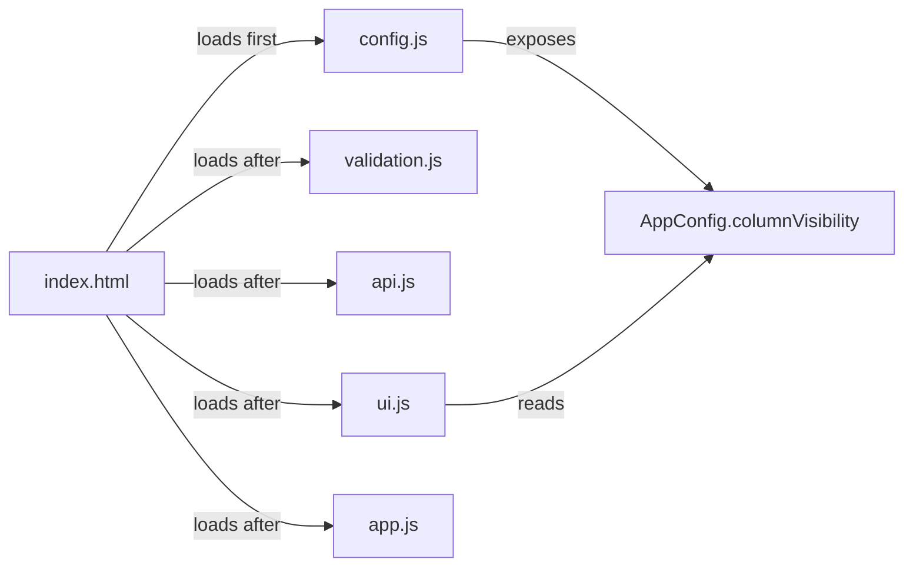

# Design Document: Column Visibility Configuration

## Overview

This feature introduces a configuration-driven mechanism for controlling which columns are visible in the support cases table. A new `config.js` file exposes a global `AppConfig` object with a `columnVisibility` property. The `renderCaseList` function in `ui.js` consults this configuration at render time to determine which columns (headers and data cells) to include in the table.

The design prioritizes backward compatibility — when no config is defined, or when a column identifier is absent from the config, all columns render as before.

## Architecture

The feature adds a single new file (`webui/js/config.js`) and modifies the rendering path in `ui.js`. No backend changes are required.



**Script loading order**: `config.js` is loaded before all other application scripts so that `AppConfig` is available as a global by the time `ui.js` executes.

**Data flow at render time**:
1. `renderCaseList(cases)` is called
2. The function reads `AppConfig.columnVisibility` (with safe fallbacks)
3. For each column identifier, it checks whether the column is visible
4. Only visible columns get header cells and data cells appended to the table

## Components and Interfaces

### config.js (new file)

Exposes a global `AppConfig` object:

```javascript
var AppConfig = {
  columnVisibility: {
    caseId: true,
    email: true,
    issue: true,
    severity: true,
    response: true,
    actions: true
  }
};
```

**Interface contract**:
- `AppConfig` is a plain object on `window`/global scope
- `AppConfig.columnVisibility` is an object mapping `Column_Identifier` → `boolean`
- Valid column identifiers: `caseId`, `email`, `issue`, `severity`, `response`, `actions`
- Default value for every flag: `true`

### renderCaseList modifications (ui.js)

The function will use a column definition array that pairs each column identifier with its header text and cell-rendering logic. At render time, this array is filtered to only include columns whose visibility flag resolves to `true`.

**Visibility resolution logic**:

```javascript
function isColumnVisible(columnId) {
  if (typeof AppConfig === 'undefined' || !AppConfig) return true;
  if (!AppConfig.columnVisibility) return true;
  var value = AppConfig.columnVisibility[columnId];
  if (typeof value !== 'boolean') return true;
  return value;
}
```

This function returns `true` (show column) unless the config explicitly sets the column to `false`. Non-boolean values, missing keys, and absent config all default to visible.

### Column definition structure

```javascript
var columns = [
  { id: 'caseId', header: 'Case ID', render: function(c) { /* ... */ } },
  { id: 'email', header: 'Email', render: function(c) { /* ... */ } },
  { id: 'issue', header: 'Issue', render: function(c) { /* ... */ } },
  { id: 'severity', header: 'Severity', render: function(c) { /* ... */ } },
  { id: 'response', header: 'Response', render: function(c) { /* ... */ } },
  { id: 'actions', header: 'Actions', render: function(c) { /* ... */ } }
];

var visibleColumns = columns.filter(function(col) {
  return isColumnVisible(col.id);
});
```

The renderer then iterates `visibleColumns` to build headers and row cells.

## Data Models

### AppConfig shape

| Property | Type | Default | Description |
|----------|------|---------|-------------|
| `columnVisibility` | `object` | `{}` with all `true` | Maps column identifiers to boolean visibility flags |
| `columnVisibility.caseId` | `boolean` | `true` | Show/hide Case ID column |
| `columnVisibility.email` | `boolean` | `true` | Show/hide Email column |
| `columnVisibility.issue` | `boolean` | `true` | Show/hide Issue column |
| `columnVisibility.severity` | `boolean` | `true` | Show/hide Severity column |
| `columnVisibility.response` | `boolean` | `true` | Show/hide Response column |
| `columnVisibility.actions` | `boolean` | `true` | Show/hide Actions column |

### Column identifier to header mapping

| Identifier | Header Text |
|-----------|-------------|
| `caseId` | Case ID |
| `email` | Email |
| `issue` | Issue |
| `severity` | Severity |
| `response` | Response |
| `actions` | Actions |

## Correctness Properties

*A property is a characteristic or behavior that should hold true across all valid executions of a system — essentially, a formal statement about what the system should do. Properties serve as the bridge between human-readable specifications and machine-verifiable correctness guarantees.*

### Property 1: Visible column count matches configuration

*For any* valid `columnVisibility` configuration (an object mapping column identifiers to booleans), the number of `<th>` elements in the rendered table header SHALL equal the number of columns whose visibility resolves to `true`.

**Validates: Requirements 3.2, 3.4**

### Property 2: Hidden columns produce no cells

*For any* column identifier set to `false` in `columnVisibility`, and for any non-empty array of cases, the rendered table SHALL contain zero header cells and zero data cells for that column's header text.

**Validates: Requirements 3.2, 3.3**

### Property 3: Row cell count matches header count

*For any* valid `columnVisibility` configuration and any non-empty array of cases, every `<tr>` in the table body SHALL have exactly the same number of `<td>` cells as there are `<th>` elements in the table header.

**Validates: Requirements 3.2, 3.3, 3.4**

### Property 4: Missing or invalid config defaults to all-visible

*For any* non-empty array of cases, when `AppConfig` is undefined, or `columnVisibility` is missing, or a column identifier is absent from `columnVisibility`, or a column identifier maps to a non-boolean value, the rendered table SHALL contain 6 header columns (the full set).

**Validates: Requirements 4.1, 4.2, 5.1**

### Property 5: Unknown keys are ignored

*For any* `columnVisibility` object containing extra keys (not matching any valid column identifier), the rendered table SHALL behave identically to a config without those extra keys — rendering all valid columns according to their own visibility flags.

**Validates: Requirements 5.2**

## Error Handling

| Scenario | Behavior |
|----------|----------|
| `AppConfig` not defined (config.js missing or fails to load) | All columns rendered — `isColumnVisible` returns `true` |
| `AppConfig.columnVisibility` is `null` or `undefined` | All columns rendered |
| A column identifier has a non-boolean value (string, number, object) | That column is treated as visible |
| Unknown keys in `columnVisibility` | Ignored silently — no errors thrown |
| All columns set to `false` | Table renders with no header cells and no data cells per row (empty table structure with thead/tbody) |

No exceptions are thrown. The design follows a "fail-open" strategy: any misconfiguration results in columns being shown rather than hidden.

## Testing Strategy

### Property-based tests (fast-check)

The feature is well-suited to PBT because:
- `isColumnVisible` and the column-filtering logic are pure functions
- The input space (all combinations of 6 boolean flags × arbitrary case data) is large
- Universal properties hold across all valid configurations

**Library**: fast-check 3.22.0 (already installed in `webui/package.json`)

**Configuration**: Each property test runs a minimum of 100 iterations.

**Tag format**: `Feature: column-visibility-config, Property {number}: {property_text}`

Each correctness property above maps to a single property-based test that:
1. Generates a random `columnVisibility` config (arbitrary subset of identifiers mapped to booleans, with optional non-boolean values and unknown keys)
2. Generates a random non-empty array of case objects
3. Sets the global `AppConfig` to the generated config
4. Calls `renderCaseList`
5. Asserts the property against the rendered DOM

### Unit tests (example-based)

- Config file loads correctly and `AppConfig` is structured as expected
- Script ordering in `index.html` places `config.js` first
- Specific example: hiding `email` and `severity` produces 4-column table
- Specific example: all columns hidden produces empty table structure
- Specific example: default config (all `true`) matches original 6-column behavior

### Integration

- Manual verification: edit `config.js`, reload the page, confirm columns hide/show
- No backend changes required — the feature is entirely client-side
