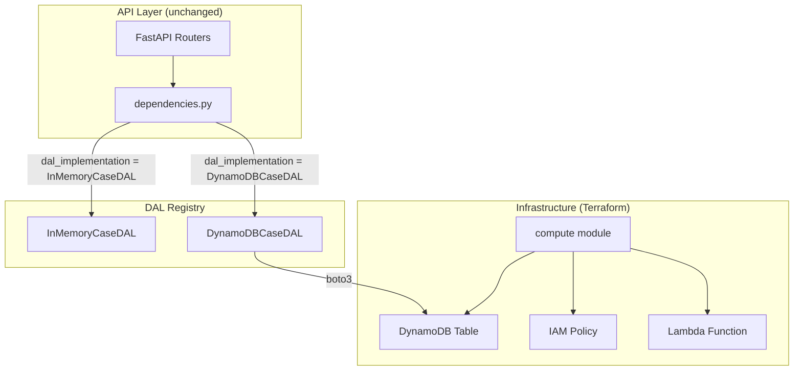

# Design Document: DynamoDB Backend

## Overview

This feature adds DynamoDB as a persistent backend for the support cases API. It introduces three coordinated changes:

1. **Infrastructure**: A Terraform-managed DynamoDB table and IAM policy within the existing `compute` module.
2. **Application**: A `DynamoDBCaseDAL` class that implements the `CaseDAL` abstract base class using boto3.
3. **Modularity**: Conditional registration in `dependencies.py` so that the DynamoDB DAL is only loaded when the `aws_dal` package is present on the Python path. AWS-specific dependencies (`boto3`) are isolated in `requirements-aws.txt`, keeping the core runtime free of AWS libraries.

The design preserves the existing DAL abstraction — the router layer is unchanged and the in-memory DAL continues to work for local development and testing.

## Architecture



**Key design decisions:**

1. **DynamoDB table lives in the compute module** — The table is tightly coupled to the Lambda (same lifecycle, same IAM role), so co-locating avoids cross-module dependency wiring.
2. **`aws_dal` is a sibling package to `app`** — Keeps AWS-specific dependencies out of the core application. The Lambda deployment ZIP includes both `app/` and `aws_dal/`, while local development only needs `app/`.
3. **Conditional import via try/except** — Simple, no build flags needed. If `aws_dal` isn't on `sys.path`, the app runs with whatever DAL implementations are already registered.
4. **On-demand billing (PAY_PER_REQUEST)** — No capacity planning needed for a support cases workload with unpredictable traffic patterns.

## Components and Interfaces

### 1. Terraform: Compute Module Additions

**File:** `terraform/aws/modules/compute/main.tf`

New resources added to the existing compute module:

| Resource | Purpose |
|----------|---------|
| `aws_dynamodb_table.cases` | DynamoDB table for case storage |
| `aws_iam_role_policy.lambda_dynamodb` | IAM policy granting `dynamodb:*` on the cases table |

**New outputs** (`terraform/aws/modules/compute/outputs.tf`):

| Output | Value |
|--------|-------|
| `cases_table_name` | The DynamoDB table name |
| `cases_table_arn` | The DynamoDB table ARN |

**Root module wiring** (`terraform/aws/main.tf`):

The root module passes the table name into the Lambda environment variables:

```hcl
environment_variables = merge(var.app_environment_variables, {
  DYNAMODB_TABLE_NAME = module.compute.cases_table_name
})
```

The Lambda `depends_on` block is extended to include the DynamoDB IAM policy, ensuring permissions exist before the function is deployed.

### 2. DynamoDBCaseDAL

**File:** `api/aws-dal/dynamodb_case_dal.py`

```python
class DynamoDBCaseDAL(CaseDAL):
    def __init__(self) -> None:
        # Reads table name from AppSettings (DYNAMODB_TABLE_NAME env var)
        # Raises RuntimeError if not configured
        ...

    def create_case(self, case: CaseModel) -> CaseModel: ...
    def update_case(self, case_id: UUID, case: CaseModel) -> CaseModel: ...
    def delete_case(self, case_id: UUID) -> None: ...
    def get_all_cases(self) -> list[CaseModel]: ...
    def get_case_by_id(self, case_id: UUID) -> CaseModel: ...
```

**Internal helpers:**

| Method | Purpose |
|--------|---------|
| `_serialize(case: CaseModel) -> dict` | Converts CaseModel to DynamoDB item dict (all String attributes) |
| `_deserialize(item: dict) -> CaseModel` | Converts DynamoDB item dict back to CaseModel |

**DynamoDB interaction patterns:**

| DAL Method | DynamoDB API | Condition Expression |
|------------|-------------|---------------------|
| `create_case` | `put_item` | `attribute_not_exists(case_id)` — raises ValueError on conflict |
| `update_case` | `put_item` | `attribute_exists(case_id)` — raises KeyError if missing |
| `delete_case` | `delete_item` | `attribute_exists(case_id)` — raises KeyError if missing |
| `get_case_by_id` | `get_item` | Check response for `Item` key — raise KeyError if absent |
| `get_all_cases` | `scan` (paginated) | Loop on `LastEvaluatedKey` until exhausted |

**Dependency management:** The `boto3` dependency is declared in `api/requirements-aws.txt` (not the core `requirements.txt`), ensuring non-AWS deployments don't pull in AWS libraries. Test-only dependencies (`moto`, `hypothesis`, `pytest`, `httpx`) are in `api/requirements-dev.txt`. The Lambda build script uses `requirements-aws.txt` to produce a deployment package with core + AWS deps only.

### 3. Conditional Registration

**File:** `api/app/dependencies.py`

```python
# After existing InMemoryCaseDAL registration:
try:
    from aws_dal.dynamodb_case_dal import DynamoDBCaseDAL
    DAL_REGISTRY["DynamoDBCaseDAL"] = DynamoDBCaseDAL
except (ImportError, AttributeError):
    pass
```

The `except` catches both:
- `ImportError` — `aws_dal` package not on path (local dev)
- `AttributeError` — package exists but class not found (broken install)

### 4. AppSettings Extension

**File:** `api/app/config.py`

```python
class AppSettings(BaseSettings):
    dal_implementation: str = "InMemoryCaseDAL"
    dynamodb_table_name: str = ""  # Populated from DYNAMODB_TABLE_NAME env var
```

The `DynamoDBCaseDAL.__init__` reads `get_settings().dynamodb_table_name` and raises `RuntimeError` if empty.

## Data Models

### DynamoDB Table Schema

| Attribute | DynamoDB Type | Source Field |
|-----------|--------------|--------------|
| `case_id` | S (String) | `CaseModel.case_id` (UUID serialized as string) |
| `email` | S (String) | `CaseModel.email` |
| `issue` | S (String) | `CaseModel.issue` |
| `response` | S (String) | `CaseModel.response` |
| `severity` | S (String) | `CaseModel.severity` |

**Key schema:** Single partition key `case_id` (type S). No sort key — each case is accessed by its unique ID.

**Serialization rules:**
- `case_id` (UUID) → string via `str(uuid)` → UUID via `uuid.UUID(string)`
- All other fields are stored as-is (already strings)
- No use of DynamoDB Number or Binary types — all attributes are String for simplicity and because the CaseModel fields are all text-representable

### Terraform Resource Naming

| Resource | Name Pattern |
|----------|-------------|
| DynamoDB table | `{environment}-{project_name}-cases` |
| IAM policy | `{role_name}-dynamodb` |

## Correctness Properties

*A property is a characteristic or behavior that should hold true across all valid executions of a system — essentially, a formal statement about what the system should do. Properties serve as the bridge between human-readable specifications and machine-verifiable correctness guarantees.*

The following properties apply to the DynamoDB DAL implementation (Requirement 3). Requirements 1, 2, 4, and 5 cover infrastructure configuration and conditional module loading — these are verified through example-based unit tests and Terraform plan validation, not property-based testing.

### Property 1: Create-then-retrieve round-trip

*For any* valid CaseModel instance, creating the case via `create_case` and then retrieving it via `get_case_by_id` SHALL return a CaseModel whose field values (case_id, email, issue, response, severity) are all equal to the original.

**Validates: Requirements 3.8, 3.9**

### Property 2: Duplicate create rejection preserves store

*For any* valid CaseModel that has already been persisted, calling `create_case` again with a CaseModel having the same `case_id` SHALL raise a `ValueError`, and the originally stored case SHALL remain unchanged.

**Validates: Requirements 3.3**

### Property 3: Non-existent ID operations raise KeyError

*For any* UUID that is not present in the Cases_Table, calling `get_case_by_id`, `update_case`, or `delete_case` with that UUID SHALL raise a `KeyError`.

**Validates: Requirements 3.4, 3.5, 3.6**

### Property 4: Pagination returns complete results

*For any* set of N distinct CaseModel instances stored in the Cases_Table (where the scan response is split across multiple pages), calling `get_all_cases` SHALL return exactly N items, and every stored case SHALL appear in the returned list.

**Validates: Requirements 3.11**

## Error Handling

| Scenario | Raised Exception | Handling |
|----------|-----------------|----------|
| `DYNAMODB_TABLE_NAME` not set/empty | `RuntimeError` at DAL init | Fail fast — application won't start without valid config |
| Duplicate `case_id` on create | `ValueError` | DynamoDB condition expression failure → caught and raised as ValueError |
| Non-existent `case_id` on get/update/delete | `KeyError` | DynamoDB missing item / condition failure → caught and raised as KeyError |
| boto3 `ClientError` (connectivity, throttling, service error) | Propagated as-is | No swallowing — caller (router) handles HTTP error mapping |
| `aws_dal` package not importable | No exception | Graceful skip in `dependencies.py` — in-memory DAL remains available |
| `DynamoDBCaseDAL` class not resolvable from `aws_dal` | No exception | `AttributeError` caught — registry unchanged |

**DynamoDB condition expression mapping:**

```python
# In create_case:
try:
    table.put_item(Item=item, ConditionExpression="attribute_not_exists(case_id)")
except ClientError as e:
    if e.response["Error"]["Code"] == "ConditionalCheckFailedException":
        raise ValueError(f"Case with case_id={case.case_id} already exists")
    raise  # Propagate other errors

# In update_case / delete_case:
try:
    # ... with ConditionExpression="attribute_exists(case_id)"
except ClientError as e:
    if e.response["Error"]["Code"] == "ConditionalCheckFailedException":
        raise KeyError(case_id)
    raise  # Propagate other errors
```

## Testing Strategy

### Property-Based Tests (Hypothesis)

The project already uses Hypothesis for property-based testing of the `InMemoryCaseDAL`. The same property tests will be extended to cover `DynamoDBCaseDAL` using a mocked boto3 DynamoDB resource (via `moto` or `unittest.mock`).

**Configuration:**
- Library: `hypothesis==6.112.2` (in `requirements-dev.txt`)
- DynamoDB mocking: `moto==5.0.22` (in `requirements-dev.txt`)
- AWS SDK: `boto3==1.35.36` (in `requirements-aws.txt`)
- Minimum iterations: 100 per property (`@settings(max_examples=100)`)
- Mocking: `moto` library for local DynamoDB simulation, or `unittest.mock.patch` for boto3 table methods

**Property test tagging format:**
```python
# Feature: dynamodb-backend, Property 1: Create-then-retrieve round-trip
```

Each correctness property maps to a single property-based test function.

**Existing strategies reused:** The `valid_case_model()` and `distinct_case_models()` strategies from `test_case_dal_properties.py` are reused for the DynamoDB DAL tests.

### Unit Tests (Example-Based)

| Area | Test Cases |
|------|------------|
| Configuration | Missing `DYNAMODB_TABLE_NAME` raises RuntimeError |
| Configuration | Valid `DYNAMODB_TABLE_NAME` initializes successfully |
| Error propagation | boto3 `ClientError` propagates without being swallowed |
| Conditional import (success) | `DynamoDBCaseDAL` appears in `DAL_REGISTRY` |
| Conditional import (failure) | `DAL_REGISTRY` unchanged, no exception |
| Conditional import (AttributeError) | Package importable but class missing — graceful |
| `get_dal` integration | Returns `DynamoDBCaseDAL` instance when configured and importable |
| `get_dal` error | Raises `ValueError` when configured but not importable |

### Infrastructure Tests

Terraform configuration is validated through:
- `terraform validate` — syntax and type correctness
- `terraform plan` — resource creation verification
- Manual review of plan output for naming patterns, tags, and IAM policy scope

No property-based testing for Terraform (IaC is declarative configuration, not functional logic).
