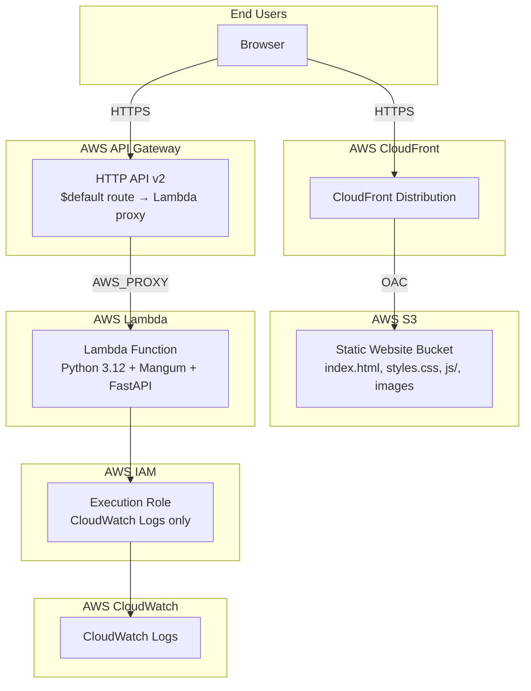
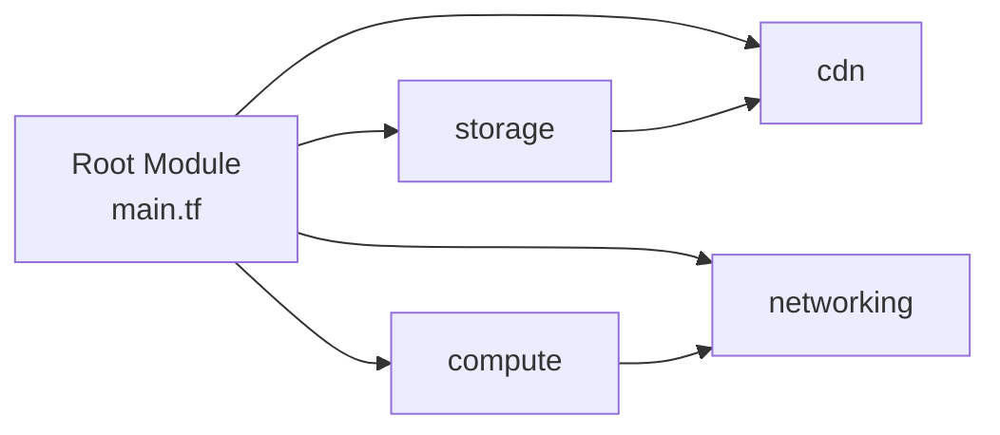

# Design Document: Terraform AWS Infrastructure

## Overview

This design defines the Terraform infrastructure-as-code architecture for deploying the MicroDigitech Support Cases application to AWS. The system consists of two primary components:

1. **WebUI** — A static HTML/CSS/JS application hosted on S3 and served globally via CloudFront CDN
2. **API** — A FastAPI application deployed to AWS Lambda, fronted by an HTTP API Gateway

The Terraform configuration follows a modular, multi-cloud-ready directory structure that isolates provider-specific resources and supports environment-based deployments (dev, staging, prod) via variable files.

### Key Design Decisions

| Decision | Rationale |
|----------|-----------|
| HTTP API (v2) over REST API (v1) | Lower latency, lower cost, simpler proxy config for Lambda |
| Origin Access Control (OAC) over Origin Access Identity (OAI) | OAC is the current AWS recommendation; supports SSE-KMS and more granular policies |
| ZIP deployment over container image | Simpler for a small FastAPI app; avoids ECR dependency |
| Modular directory structure | Enables future GCP/Azure providers without restructuring |
| S3 + DynamoDB backend | Standard pattern for team collaboration with state locking |

## Architecture



### Request Flow

1. **Static content**: Browser → CloudFront → S3 (via OAC, HTTPS only, HTTP redirected)
2. **API calls**: Browser → API Gateway HTTP API → Lambda (Mangum adapter → FastAPI)

## Components and Interfaces

### Directory Layout

```
terraform/
└── aws/
    ├── main.tf                    # Root module: composes child modules
    ├── variables.tf               # Root-level input variables
    ├── outputs.tf                 # Root-level outputs (API URL, CloudFront URL, bucket name)
    ├── providers.tf               # AWS provider configuration
    ├── backend.tf                 # S3/DynamoDB backend configuration (partial)
    ├── terraform.tfvars           # Default variable values (non-sensitive)
    ├── environments/
    │   ├── dev.tfvars             # Dev environment overrides
    │   ├── staging.tfvars         # Staging environment overrides
    │   └── prod.tfvars            # Production environment overrides
    └── modules/
        ├── storage/
        │   ├── main.tf            # S3 bucket, bucket policy, public access block
        │   ├── variables.tf       # Module inputs (environment, project name)
        │   └── outputs.tf         # Bucket name, bucket ARN, regional domain
        ├── cdn/
        │   ├── main.tf            # CloudFront distribution, OAC, cache policies
        │   ├── variables.tf       # Module inputs (bucket domain, OAC config)
        │   └── outputs.tf         # Distribution domain, distribution ID
        ├── compute/
        │   ├── main.tf            # Lambda function, IAM role, CloudWatch policy
        │   ├── variables.tf       # Module inputs (runtime, memory, timeout, env vars)
        │   └── outputs.tf         # Function ARN, function name, invoke ARN
        └── networking/
            ├── main.tf            # API Gateway HTTP API, integration, routes, CORS
            ├── variables.tf       # Module inputs (Lambda invoke ARN, CORS origins)
            └── outputs.tf         # API invoke URL, API ID
```

### Module Dependency Graph



- **storage** is created first (S3 bucket)
- **cdn** depends on storage (needs bucket domain name for origin)
- **compute** is independent (Lambda + IAM)
- **networking** depends on compute (needs Lambda invoke ARN for integration)

### Module Interfaces

#### Storage Module

| Input | Type | Description |
|-------|------|-------------|
| `environment` | `string` | Environment name prefix (dev/staging/prod) |
| `project_name` | `string` | Project identifier for resource naming |
| `cloudfront_distribution_arn` | `string` | CloudFront distribution ARN for bucket policy |
| `tags` | `map(string)` | Common resource tags |

| Output | Type | Description |
|--------|------|-------------|
| `bucket_name` | `string` | S3 bucket name for asset sync |
| `bucket_arn` | `string` | Bucket ARN for IAM policies |
| `bucket_regional_domain_name` | `string` | Regional domain for CloudFront origin |

#### CDN Module

| Input | Type | Description |
|-------|------|-------------|
| `environment` | `string` | Environment name prefix |
| `project_name` | `string` | Project identifier |
| `origin_domain_name` | `string` | S3 bucket regional domain name |
| `origin_bucket_arn` | `string` | S3 bucket ARN for OAC policy |
| `default_ttl` | `number` | Default cache TTL (86400s) |
| `index_max_ttl` | `number` | Max TTL for index.html (300s) |
| `tags` | `map(string)` | Common resource tags |

| Output | Type | Description |
|--------|------|-------------|
| `distribution_domain_name` | `string` | CloudFront domain (e.g., d1234.cloudfront.net) |
| `distribution_arn` | `string` | Distribution ARN for bucket policy reference |
| `distribution_id` | `string` | Distribution ID for cache invalidation |

#### Compute Module

| Input | Type | Description |
|-------|------|-------------|
| `environment` | `string` | Environment name prefix |
| `project_name` | `string` | Project identifier |
| `runtime` | `string` | Lambda runtime (python3.12) |
| `memory_size` | `number` | Memory in MB (256) |
| `timeout` | `number` | Timeout in seconds (30) |
| `handler` | `string` | Lambda handler entry point |
| `deployment_package_path` | `string` | Path to the ZIP deployment package |
| `environment_variables` | `map(string)` | App environment variables for Pydantic BaseSettings |
| `tags` | `map(string)` | Common resource tags |

| Output | Type | Description |
|--------|------|-------------|
| `function_arn` | `string` | Lambda function ARN |
| `function_name` | `string` | Lambda function name |
| `invoke_arn` | `string` | Lambda invoke ARN for API Gateway integration |

#### Networking Module

| Input | Type | Description |
|-------|------|-------------|
| `environment` | `string` | Environment name prefix |
| `project_name` | `string` | Project identifier |
| `lambda_invoke_arn` | `string` | Lambda invoke ARN |
| `lambda_function_name` | `string` | Lambda function name (for permission) |
| `cors_allowed_origins` | `list(string)` | CORS allowed origins |
| `tags` | `map(string)` | Common resource tags |

| Output | Type | Description |
|--------|------|-------------|
| `api_invoke_url` | `string` | Full invoke URL (https://{id}.execute-api.{region}.amazonaws.com) |
| `api_id` | `string` | API Gateway ID |

## Data Models

### Terraform Variables (Root Module)

```hcl
variable "environment" {
  type        = string
  description = "Deployment environment (dev, staging, prod)"
  validation {
    condition     = contains(["dev", "staging", "prod"], var.environment)
    error_message = "Environment must be one of: dev, staging, prod."
  }
}

variable "aws_region" {
  type        = string
  description = "AWS region for resource deployment"
  default     = "us-east-1"
}

variable "project_name" {
  type        = string
  description = "Project name used in resource naming and tagging"
  default     = "microdigitech-cases"
}

variable "lambda_memory_size" {
  type        = number
  description = "Lambda function memory allocation in MB"
  default     = 256
}

variable "lambda_timeout" {
  type        = number
  description = "Lambda function timeout in seconds"
  default     = 30
}

variable "cors_allowed_origins" {
  type        = list(string)
  description = "List of origins allowed for CORS on the API Gateway"
  default     = ["*"]
}

variable "deployment_package_path" {
  type        = string
  description = "Path to the Lambda deployment ZIP archive"
  default     = "../../dist/lambda.zip"
}

variable "app_environment_variables" {
  type        = map(string)
  description = "Environment variables passed to the Lambda function for Pydantic BaseSettings"
  default     = {}
}
```

### Terraform Outputs (Root Module)

```hcl
output "api_invoke_url" {
  value       = module.networking.api_invoke_url
  description = "API Gateway invoke URL for WebUI configuration to set API base endpoint"
}

output "cloudfront_url" {
  value       = "https://${module.cdn.distribution_domain_name}"
  description = "CloudFront distribution HTTPS URL for WebUI access"
}

output "website_bucket_name" {
  value       = module.storage.bucket_name
  description = "S3 bucket name for deployment scripts to sync WebUI assets"
}

output "cloudfront_distribution_id" {
  value       = module.cdn.distribution_id
  description = "CloudFront distribution ID for deployment scripts to invalidate cache"
}
```

### Resource Naming Convention

All resources follow the pattern: `{environment}-{project_name}-{resource_type}`

Examples:
- S3 bucket: `dev-microdigitech-cases-webui`
- Lambda function: `dev-microdigitech-cases-api`
- IAM role: `dev-microdigitech-cases-lambda-role`
- API Gateway: `dev-microdigitech-cases-api-gw`

### Tagging Schema

```hcl
locals {
  common_tags = {
    Environment = var.environment
    Project     = var.project_name
    ManagedBy   = "terraform"
  }
}
```

## Error Handling

### Terraform Validation Errors

| Scenario | Handling |
|----------|----------|
| Invalid environment value | `variable.validation` block rejects with descriptive error listing allowed values |
| Missing deployment package | `terraform plan` fails with file-not-found at the `data.archive_file` or `aws_lambda_function` resource |
| Backend lock timeout | S3/DynamoDB backend fails after 60s with lock-holder information |
| Invalid CORS origin format | Validation at variable level ensures well-formed origins |

### Runtime Error Handling (Lambda)

The Lambda function handler is defined as a Mangum-wrapped FastAPI app. If initialization fails or an unhandled error occurs:
- Mangum returns a 500 response with error details
- Lambda automatically logs the error to CloudWatch Logs via the IAM execution role permissions
- The error includes traceback information in the CloudWatch log stream

### State Management Errors

| Scenario | Handling |
|----------|----------|
| No backend configured | Falls back to local state file (no network required) |
| Lock contention | DynamoDB lock acquisition times out at 60s with error message |
| State corruption | Terraform plan detects drift; manual intervention required |

### Deployment Errors

| Scenario | Handling |
|----------|----------|
| Package exceeds size limit | `terraform plan` reports Lambda deployment package size violation |
| Missing required env vars | Pydantic BaseSettings raises `ValidationError` at Lambda cold start |
| IAM permission denied | Lambda invocation returns 500; CloudWatch logs show permission error |

## Testing Strategy

### Why Property-Based Testing Does Not Apply

This feature is Infrastructure as Code (Terraform). Terraform configurations are declarative — they describe desired state rather than implementing functions with inputs and outputs. There are no pure functions to test across a wide input space, and the "behavior" is provisioning cloud resources, which is verified through different means.

### Testing Approach

#### 1. Terraform Validation Tests

Verify that the configuration is syntactically and semantically valid:

```bash
# Format check
terraform fmt -check -recursive terraform/aws/

# Validation (catches type errors, missing required variables, validation blocks)
terraform validate
```

#### 2. Terraform Plan Tests (Dry Run)

Verify that plans produce expected resource counts and configurations per environment:

```bash
# Plan for each environment
terraform plan -var-file=environments/dev.tfvars -out=dev.plan
terraform plan -var-file=environments/staging.tfvars -out=staging.plan
terraform plan -var-file=environments/prod.tfvars -out=prod.plan
```

Validate:
- Correct number of resources created
- Resource names contain environment prefix
- Tags are applied to all taggable resources
- No unexpected resource deletions on re-plan

#### 3. Variable Validation Tests

Verify that Terraform's built-in validation blocks reject invalid inputs:

- Environment set to "invalid" → validation error with allowed values message
- Environment set to "production" (too long / not in set) → validation error

#### 4. Module Isolation Tests

Each module can be tested independently with mock inputs:

- **storage**: Verify bucket policy denies public access, OAC condition present
- **cdn**: Verify HTTPS-only, redirect behavior, cache TTLs, custom error response for SPA
- **compute**: Verify IAM role has minimum permissions (CloudWatch only), correct runtime/memory/timeout
- **networking**: Verify CORS configuration, catch-all route, Lambda integration type

#### 5. Integration Tests (Post-Apply)

After `terraform apply` in a test environment:

- Verify CloudFront serves `index.html` over HTTPS
- Verify HTTP → HTTPS redirect works
- Verify API Gateway returns 200 from health check endpoint
- Verify S3 bucket rejects direct public access (403)
- Verify Lambda function responds through API Gateway with correct CORS headers

#### 6. Security Compliance Checks

- No hard-coded credentials in any `.tf` file (grep/scan)
- All sensitive variables marked `sensitive = true`
- S3 public access block enabled on all four settings
- IAM role follows least-privilege (no wildcard resource ARNs)
- Lambda resource policy scoped to specific API Gateway ARN

### Test Execution

```bash
# Static validation
terraform fmt -check -recursive terraform/aws/
terraform -chdir=terraform/aws init -backend=false
terraform -chdir=terraform/aws validate

# Plan verification (per environment)
terraform -chdir=terraform/aws plan -var-file=environments/dev.tfvars

# Post-deploy smoke tests (after apply)
curl -s https://<cloudfront-domain>/ | grep -q "Cases Web UI"
curl -s https://<api-gw-url>/  | grep -q '"status":"ok"'
```
