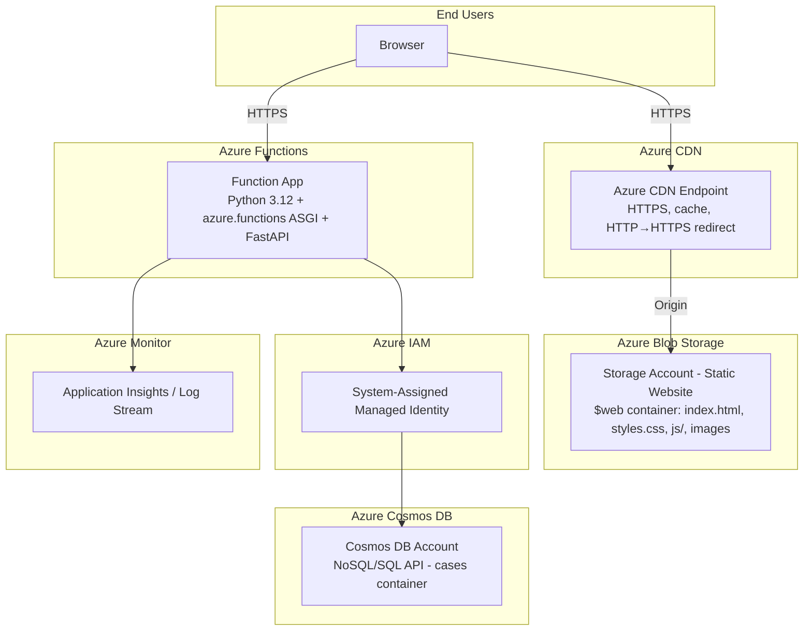
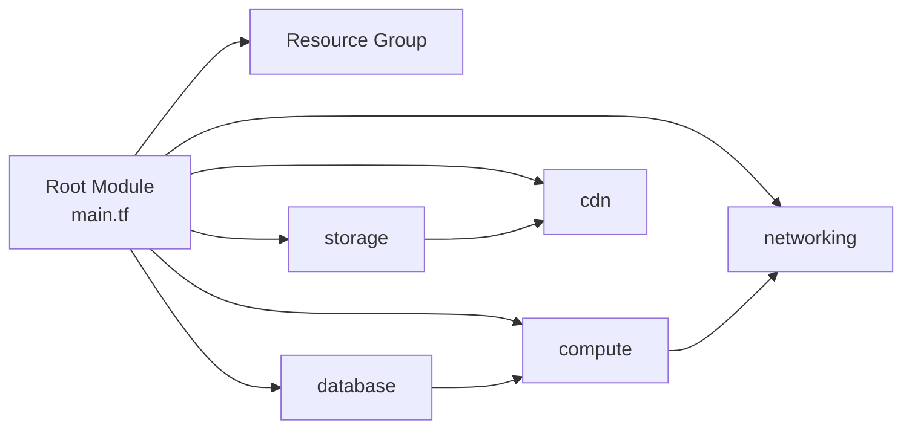

# Design Document: Terraform Azure Infrastructure

## Overview

This design defines the Terraform infrastructure-as-code architecture for deploying the MicroDigitech Support Cases application to Microsoft Azure. The system mirrors the existing AWS deployment with equivalent Azure services:

1. **WebUI** — A static HTML/CSS/JS application hosted on Azure Blob Storage (static website) and served globally via Azure CDN
2. **API** — A FastAPI application deployed to Azure Functions (Python, Consumption Plan) with HTTP triggers
3. **Database** — Azure Cosmos DB (NoSQL/SQL API) for case data persistence

The Terraform configuration lives at `terraform/azure/`, parallel to `terraform/aws/`, and follows the same modular structure with child modules for each infrastructure concern.

### Key Design Decisions

| Decision | Rationale |
|----------|-----------|
| Azure Functions Consumption Plan over App Service | Pay-per-execution, auto-scaling, mirrors Lambda billing model |
| Azure CDN Standard over Azure Front Door | Simpler, lower cost for static site delivery; Front Door is overkill for a single-origin CDN |
| Cosmos DB Serverless over provisioned throughput (default) | Aligns with consumption-based billing; no idle costs for dev/staging |
| Blob Storage static website over Azure Static Web Apps | Direct equivalent to S3 static hosting; keeps CDN control explicit |
| System-assigned Managed Identity over Service Principal | No credential rotation needed; identity lifecycle tied to resource |
| `azurerm` backend with blob lease locking | Azure-native state management; equivalent to S3+DynamoDB pattern |
| OIDC via `azure/login` over stored credentials | Secretless CI/CD authentication; mirrors AWS OIDC pattern |
| Separate `requirements-azure.txt` | Azure SDK dependencies isolated from AWS dependencies |

## Architecture



### Request Flow

1. **Static content**: Browser → Azure CDN → Blob Storage static website endpoint (HTTPS, HTTP redirected)
2. **API calls**: Browser → Azure Functions HTTP trigger (HTTPS) → FastAPI via ASGI adapter → Cosmos DB

## Components and Interfaces

### Directory Layout

```
terraform/
└── azure/
    ├── main.tf                    # Root module: resource group + composes child modules
    ├── variables.tf               # Root-level input variables
    ├── outputs.tf                 # Root-level outputs (Function URL, CDN URL, storage name)
    ├── providers.tf               # AzureRM provider configuration
    ├── backend.tf                 # azurerm backend configuration (partial)
    ├── terraform.tfvars           # Default variable values (non-sensitive)
    ├── environments/
    │   ├── dev.tfvars             # Dev environment overrides
    │   ├── staging.tfvars         # Staging environment overrides
    │   └── prod.tfvars            # Production environment overrides
    └── modules/
        ├── storage/
        │   ├── main.tf            # Storage account, static website, $web container
        │   ├── variables.tf       # Module inputs
        │   └── outputs.tf         # Storage account name, primary web endpoint
        ├── cdn/
        │   ├── main.tf            # CDN profile, endpoint, HTTPS redirect rule
        │   ├── variables.tf       # Module inputs
        │   └── outputs.tf         # CDN endpoint hostname, profile name, endpoint name
        ├── compute/
        │   ├── main.tf            # Function App, App Service Plan, function storage account, managed identity
        │   ├── variables.tf       # Module inputs
        │   └── outputs.tf         # Function App hostname, function app name, identity principal ID
        ├── networking/
        │   ├── main.tf            # Function App CORS settings (configured on the Function App resource)
        │   ├── variables.tf       # Module inputs
        │   └── outputs.tf         # Function App URL with CORS configured
        └── database/
            ├── main.tf            # Cosmos DB account, database, container
            ├── variables.tf       # Module inputs
            └── outputs.tf         # Cosmos endpoint, primary key, DB name, container name
```

### Module Dependency Graph



- **Resource Group** is created first in the root module (all modules reference it)
- **storage** is created early (Blob Storage account with static website)
- **cdn** depends on storage (needs the static website primary endpoint as origin)
- **database** is independent (Cosmos DB account, database, container)
- **compute** depends on database (needs Cosmos DB outputs for Function App settings)
- **networking** depends on compute (configures CORS on the Function App)

> **Note**: Unlike AWS where networking is a separate API Gateway resource, in Azure the HTTP endpoint is built into Azure Functions. The `networking` module configures CORS and outputs the function URL — it operates on the Function App resource created by `compute` rather than creating a separate gateway.

### Module Interfaces

#### Storage Module

| Input | Type | Description |
|-------|------|-------------|
| `environment` | `string` | Environment name prefix (dev/staging/prod) |
| `project_name` | `string` | Project identifier for resource naming |
| `resource_group_name` | `string` | Name of the resource group to deploy into |
| `azure_region` | `string` | Azure region for resource deployment |
| `tags` | `map(string)` | Common resource tags |

| Output | Type | Description |
|--------|------|-------------|
| `storage_account_name` | `string` | Storage account name for CLI asset uploads |
| `primary_web_endpoint` | `string` | Static website primary endpoint URL (origin for CDN) |
| `primary_web_host` | `string` | Static website hostname without protocol (for CDN origin) |

#### CDN Module

| Input | Type | Description |
|-------|------|-------------|
| `environment` | `string` | Environment name prefix |
| `project_name` | `string` | Project identifier |
| `resource_group_name` | `string` | Name of the resource group |
| `azure_region` | `string` | Azure region (CDN profile region) |
| `origin_host_name` | `string` | Static website hostname (from storage module) |
| `tags` | `map(string)` | Common resource tags |

| Output | Type | Description |
|--------|------|-------------|
| `cdn_endpoint_hostname` | `string` | CDN endpoint hostname (e.g., `{name}.azureedge.net`) |
| `cdn_profile_name` | `string` | CDN profile name for cache purge commands |
| `cdn_endpoint_name` | `string` | CDN endpoint name for cache purge commands |

#### Compute Module

| Input | Type | Description |
|-------|------|-------------|
| `environment` | `string` | Environment name prefix |
| `project_name` | `string` | Project identifier |
| `resource_group_name` | `string` | Name of the resource group |
| `azure_region` | `string` | Azure region |
| `deployment_package_path` | `string` | Path to the Azure Functions ZIP package |
| `app_settings` | `map(string)` | Application settings (environment variables) for the Function App |
| `tags` | `map(string)` | Common resource tags |

| Output | Type | Description |
|--------|------|-------------|
| `function_app_name` | `string` | Function App resource name |
| `function_app_default_hostname` | `string` | Default hostname (e.g., `{name}.azurewebsites.net`) |
| `identity_principal_id` | `string` | System-assigned managed identity principal ID |
| `function_app_id` | `string` | Function App resource ID (for CORS configuration) |

#### Networking Module

| Input | Type | Description |
|-------|------|-------------|
| `function_app_id` | `string` | Function App resource ID to configure CORS on |
| `cors_allowed_origins` | `list(string)` | CORS allowed origins |

| Output | Type | Description |
|--------|------|-------------|
| `function_app_url` | `string` | Full HTTPS URL of the Function App (e.g., `https://{name}.azurewebsites.net`) |

#### Database Module

| Input | Type | Description |
|-------|------|-------------|
| `environment` | `string` | Environment name prefix |
| `project_name` | `string` | Project identifier |
| `resource_group_name` | `string` | Name of the resource group |
| `azure_region` | `string` | Azure region |
| `database_name` | `string` | Cosmos DB database name (default: `microdigitech-cases`) |
| `container_name` | `string` | Cosmos DB container name (default: `cases`) |
| `partition_key_path` | `string` | Partition key path (default: `/case_id`) |
| `consistency_level` | `string` | Cosmos DB consistency level (default: `Session`) |
| `capacity_mode` | `string` | `Serverless` or `Provisioned` (default: `Serverless`) |
| `tags` | `map(string)` | Common resource tags |

| Output | Type | Description |
|--------|------|-------------|
| `cosmosdb_endpoint` | `string` | Cosmos DB account endpoint URL |
| `cosmosdb_primary_key` | `string` | Cosmos DB primary key (sensitive) |
| `cosmosdb_database_name` | `string` | Database name for app configuration |
| `cosmosdb_container_name` | `string` | Container name for app configuration |

## Data Models

### Terraform Variables (Root Module)

```hcl
variable "environment" {
  type        = string
  description = "Deployment environment (dev, staging, prod)"
  validation {
    condition     = contains(["dev", "staging", "prod"], var.environment)
    error_message = "Environment must be one of: dev, staging, prod."
  }
}

variable "azure_region" {
  type        = string
  description = "Azure region for resource deployment"
  default     = "eastus"
}

variable "project_name" {
  type        = string
  description = "Project name used in resource naming and tagging"
  default     = "microdigitech-cases"
}

variable "cors_allowed_origins" {
  type        = list(string)
  description = "List of origins allowed for CORS on the Function App"
  default     = ["*"]
}

variable "deployment_package_path" {
  type        = string
  description = "Path to the Azure Functions deployment ZIP archive"
  default     = "../../dist/azure_functions.zip"
}

variable "app_environment_variables" {
  type        = map(string)
  description = "Environment variables passed to the Function App for application configuration"
  default     = {}
}

variable "cosmosdb_consistency_level" {
  type        = string
  description = "Cosmos DB consistency level"
  default     = "Session"
  validation {
    condition     = contains(["Strong", "BoundedStaleness", "Session", "ConsistentPrefix", "Eventual"], var.cosmosdb_consistency_level)
    error_message = "Consistency level must be one of: Strong, BoundedStaleness, Session, ConsistentPrefix, Eventual."
  }
}

variable "cosmosdb_capacity_mode" {
  type        = string
  description = "Cosmos DB capacity mode (Serverless or Provisioned)"
  default     = "Serverless"
  validation {
    condition     = contains(["Serverless", "Provisioned"], var.cosmosdb_capacity_mode)
    error_message = "Capacity mode must be one of: Serverless, Provisioned."
  }
}
```

### Terraform Outputs (Root Module)

```hcl
output "function_app_url" {
  value       = "https://${module.compute.function_app_default_hostname}"
  description = "Function App HTTPS URL for WebUI configuration to set API base endpoint"
}

output "cdn_url" {
  value       = "https://${module.cdn.cdn_endpoint_hostname}"
  description = "Azure CDN endpoint HTTPS URL for WebUI access"
}

output "storage_account_name" {
  value       = module.storage.storage_account_name
  description = "Storage account name for deployment scripts to upload WebUI assets to $web container"
}

output "cdn_profile_name" {
  value       = module.cdn.cdn_profile_name
  description = "CDN profile name for deployment scripts to purge cache"
}

output "cdn_endpoint_name" {
  value       = module.cdn.cdn_endpoint_name
  description = "CDN endpoint name for deployment scripts to purge cache"
}

output "cosmosdb_endpoint" {
  value       = module.database.cosmosdb_endpoint
  description = "Cosmos DB endpoint URL for application configuration"
}
```

### Resource Naming Convention

All resources follow the pattern: `{environment}-{project_name}-{resource_type}`

Storage accounts have a special pattern due to Azure's 24-character alphanumeric-only restriction: `{environment}{project_short}{suffix}` (e.g., `devmdcasesweb`, `devmdcasesfunc`)

| Resource | Naming Pattern | Example |
|----------|---------------|---------|
| Resource Group | `{env}-{project}-rg` | `dev-microdigitech-cases-rg` |
| Storage (WebUI) | `{env}{short}web` | `devmdcasesweb` |
| Storage (Functions) | `{env}{short}func` | `devmdcasesfunc` |
| CDN Profile | `{env}-{project}-cdn` | `dev-microdigitech-cases-cdn` |
| CDN Endpoint | `{env}-{project}-ep` | `dev-microdigitech-cases-ep` |
| Function App | `{env}-{project}-func` | `dev-microdigitech-cases-func` |
| App Service Plan | `{env}-{project}-plan` | `dev-microdigitech-cases-plan` |
| Cosmos DB Account | `{env}-{project}-cosmos` | `dev-microdigitech-cases-cosmos` |

### Tagging Schema

```hcl
locals {
  common_tags = {
    Environment = var.environment
    Project     = var.project_name
    ManagedBy   = "terraform"
  }
}
```

### CosmosDB Data Access Layer Design

The `CosmosDBCaseDAL` class implements the existing `CaseDAL` abstract interface, located at `api/azure_dal/cosmosdb_case_dal.py`.

```python
# api/azure_dal/cosmosdb_case_dal.py
import os
import uuid

from azure.cosmos import CosmosClient
from azure.cosmos.exceptions import CosmosResourceExistsError, CosmosResourceNotFoundError

from app.dal.case_dal import CaseDAL
from app.models.case import CaseModel


class CosmosDBCaseDAL(CaseDAL):
    """CaseDAL implementation backed by Azure Cosmos DB (NoSQL/SQL API)."""

    def __init__(self) -> None:
        endpoint = os.environ.get("COSMOSDB_ENDPOINT", "")
        key = os.environ.get("COSMOSDB_KEY", "")
        if not endpoint or not key:
            raise RuntimeError(
                "COSMOSDB_ENDPOINT and COSMOSDB_KEY environment variables must be set."
            )
        database_name = os.environ.get("COSMOSDB_DATABASE_NAME", "microdigitech-cases")
        container_name = os.environ.get("COSMOSDB_CONTAINER_NAME", "cases")

        client = CosmosClient(endpoint, key)
        database = client.get_database_client(database_name)
        self._container = database.get_container_client(container_name)

    def _serialize(self, case: CaseModel) -> dict:
        """Convert CaseModel to Cosmos DB item (id = case_id for partition key)."""
        return {
            "id": str(case.case_id),
            "case_id": str(case.case_id),
            "email": case.email,
            "issue": case.issue,
            "response": case.response,
            "severity": case.severity,
        }

    def _deserialize(self, item: dict) -> CaseModel:
        """Convert Cosmos DB item back to CaseModel."""
        return CaseModel(
            case_id=uuid.UUID(item["case_id"]),
            email=item["email"],
            issue=item["issue"],
            response=item["response"],
            severity=item["severity"],
        )

    def create_case(self, case: CaseModel) -> CaseModel: ...
    def update_case(self, case_id, case: CaseModel) -> CaseModel: ...
    def delete_case(self, case_id) -> None: ...
    def get_all_cases(self) -> list[CaseModel]: ...
    def get_case_by_id(self, case_id) -> CaseModel: ...
```

**Key Design Points:**
- `id` field is set to `case_id` string — required by Cosmos DB as the unique item identifier
- `case_id` is also the partition key value, enabling point reads by partition key
- reads config directly from environment variables (`COSMOSDB_ENDPOINT`, `COSMOSDB_KEY`, `COSMOSDB_DATABASE_NAME`, `COSMOSDB_CONTAINER_NAME`) via `os.environ`
- `CosmosResourceExistsError` maps to `ValueError` in `create_case` (duplicate case_id)
- `CosmosResourceNotFoundError` maps to `KeyError` in `update_case`, `delete_case`, `get_case_by_id`
- `get_all_cases` uses `query_items` with `SELECT * FROM c` and cross-partition query enabled

### Environment Variable Configuration

The CosmosDBCaseDAL reads its configuration directly from environment variables:
- `DAL_IMPLEMENTATION` — Set to `azure_dal.cosmosdb_case_dal.CosmosDBCaseDAL` (read by dependencies.py)
- `COSMOSDB_ENDPOINT` — Cosmos DB account endpoint URL
- `COSMOSDB_KEY` — Cosmos DB primary key
- `COSMOSDB_DATABASE_NAME` — Database name (default: `microdigitech-cases`)
- `COSMOSDB_CONTAINER_NAME` — Container name (default: `cases`)

There is no AppSettings class or config.py. Each DAL owns its own configuration via `os.environ`. The Terraform compute module passes these as Function App application settings:

```hcl
app_settings = merge(var.app_environment_variables, {
  COSMOSDB_ENDPOINT       = module.database.cosmosdb_endpoint
  COSMOSDB_KEY            = module.database.cosmosdb_primary_key
  COSMOSDB_DATABASE_NAME  = module.database.cosmosdb_database_name
  COSMOSDB_CONTAINER_NAME = module.database.cosmosdb_container_name
  DAL_IMPLEMENTATION      = "azure_dal.cosmosdb_case_dal.CosmosDBCaseDAL"
})
```

### Build Script Design

The build script at `scripts/build_azure_functions_package.py` follows the same structure as the Lambda build script:

```
Steps:
1. Validate prerequisites (api/requirements-azure.txt, api/app/ exist)
2. Clean existing build directory
3. Create fresh build directory
4. Install dependencies from api/requirements-azure.txt into build dir
5. Copy api/app/ source code into build dir
6. Create function_app.py (Azure Functions ASGI entry point)
7. Create host.json (Azure Functions runtime config)
8. Create ZIP archive at dist/azure_functions.zip
9. Validate ZIP size (< 1GB Azure Functions limit, warn at 500MB)
10. Clean up build directory
```

**Generated `function_app.py`:**
```python
import azure.functions as func
from app.main import app as fastapi_app

app = func.AsgiFunctionApp(app=fastapi_app, http_auth_level=func.AuthLevel.ANONYMOUS)
```

**Generated `host.json`:**
```json
{
  "version": "2.0",
  "extensionBundle": {
    "id": "Microsoft.Azure.Functions.ExtensionBundle",
    "version": "[4.*, 5.0.0)"
  }
}
```

### GitHub Workflow Designs

#### Deploy Workflow (`deploy-azure.yml`)

```yaml
# Trigger: workflow_dispatch with environment choice (dev/staging/prod)
# Permissions: id-token: write, contents: read
# Secrets: AZURE_CLIENT_ID, AZURE_TENANT_ID, AZURE_SUBSCRIPTION_ID,
#          AZURE_TF_STATE_RESOURCE_GROUP, AZURE_TF_STATE_STORAGE_ACCOUNT,
#          AZURE_TF_STATE_CONTAINER

Steps:
  1. Checkout code
  2. Set up Python 3.12
  3. Azure Login via OIDC (azure/login@v2)
  4. Build Azure Functions package (python scripts/build_azure_functions_package.py)
  5. Set up Terraform (hashicorp/setup-terraform@v3)
  6. Terraform Init (with -backend-config for Azure blob backend)
  7. Terraform Plan (with environment .tfvars)
  8. Terraform Apply (with -auto-approve)
  9. Deploy WebUI (az storage blob upload-batch to $web container)
  10. Purge CDN cache (az cdn endpoint purge)
  11. Print outputs (Function App URL, CDN URL)
```

#### Teardown Workflow (`teardown-azure.yml`)

```yaml
# Trigger: workflow_dispatch with environment choice (all/dev/staging/prod)
# Permissions: id-token: write, contents: read
# Secrets: Same as deploy workflow

Steps:
  1. Checkout code
  2. Azure Login via OIDC
  3. Set up Terraform
  4. Create placeholder ZIP (dist/azure_functions.zip)
  5. For each target environment:
     a. terraform init -reconfigure (with environment-specific state key)
     b. terraform destroy -auto-approve (with environment .tfvars)
     c. On failure: write error to GitHub Step Summary, exit 1
  6. On success: write success to GitHub Step Summary
```

## Error Handling

### Terraform Validation Errors

| Scenario | Handling |
|----------|----------|
| Invalid environment value | `variable.validation` block rejects with error listing allowed values |
| Invalid consistency level | `variable.validation` block rejects with allowed Cosmos DB levels |
| Invalid capacity mode | `variable.validation` block rejects with Serverless/Provisioned options |
| Missing deployment package | `terraform plan` fails at `azurerm_function_app` resource with file-not-found |
| Backend lock timeout | Azure blob lease acquisition fails with lock-holder info |
| Storage account name too long | Naming logic truncates to 24 characters; if collision, plan shows conflict |

### Runtime Error Handling (Function App)

| Scenario | Handling |
|----------|----------|
| ASGI adapter initialization failure | Azure Functions returns HTTP 500; error logged to Log Stream |
| Pydantic BaseSettings validation error | Function App fails cold start; error in Application Insights |
| Cosmos DB connection failure | DAL raises `RuntimeError` at init; Function returns 500 |
| Unhandled exception in request | FastAPI exception handler returns JSON error; logged to App Insights |

### State Management Errors

| Scenario | Handling |
|----------|----------|
| No backend configured | Falls back to local state file (no network required) |
| Blob lease contention | Azure backend retries with timeout; surfaces lock-holder info |
| State corruption | Terraform plan detects drift; manual intervention required |
| Missing state file for environment | Terraform treats as fresh deployment (no existing resources) |

### Build Script Errors

| Scenario | Handling |
|----------|----------|
| `requirements-azure.txt` missing | Script exits with non-zero code and descriptive message |
| `api/app/` directory missing | Script exits with non-zero code and descriptive message |
| `pip install` failure | Script exits with stderr output from pip |
| ZIP exceeds 500MB warning threshold | Script prints warning but continues |
| ZIP exceeds 1GB limit | Script exits with non-zero code |

### Deployment Pipeline Errors

| Scenario | Handling |
|----------|----------|
| OIDC authentication failure | `azure/login` step fails; workflow stops |
| Terraform plan shows destroy | Plan output visible in logs; apply requires manual review |
| CDN purge failure | Non-critical; assets will expire based on TTL |
| WebUI upload failure | `az storage blob upload-batch` exits non-zero; workflow fails |

### CosmosDB DAL Errors

| Scenario | Handling |
|----------|----------|
| Duplicate case_id on create | `CosmosResourceExistsError` → `ValueError` with case_id message |
| Case not found on read/update/delete | `CosmosResourceNotFoundError` → `KeyError` with case_id |
| Missing endpoint/key configuration | `RuntimeError` raised at DAL initialization |
| Network/throttling errors | Cosmos SDK retries automatically; persistent failures propagate |

## Testing Strategy

### Why Property-Based Testing Does Not Apply

This feature is primarily Infrastructure as Code (Terraform) with a thin data access layer. Terraform configurations are declarative — they describe desired state rather than implementing functions with inputs and outputs. The DAL methods are simple CRUD operations interacting with an external service (Cosmos DB). There are no pure functions with a wide input space suitable for property-based testing.

- **Terraform modules**: Declarative configuration, not functions — use validation tests and plan verification
- **CosmosDB DAL**: CRUD operations on an external service — use mock-based unit tests and integration tests
- **Build script**: File I/O and subprocess calls — use example-based unit tests
- **GitHub workflows**: CI/CD configuration — use workflow syntax validation and manual smoke tests

### Testing Approach

#### 1. Terraform Validation Tests

Verify configuration is syntactically and semantically valid:

```bash
# Format check
terraform fmt -check -recursive terraform/azure/

# Validation (catches type errors, missing required variables, validation blocks)
terraform -chdir=terraform/azure init -backend=false
terraform -chdir=terraform/azure validate
```

#### 2. Terraform Plan Tests (Dry Run)

Verify that plans produce expected resource counts and configurations per environment:

```bash
# Plan for each environment
terraform -chdir=terraform/azure plan -var-file=environments/dev.tfvars
terraform -chdir=terraform/azure plan -var-file=environments/staging.tfvars
terraform -chdir=terraform/azure plan -var-file=environments/prod.tfvars
```

Validate:
- Correct number of resources created (resource group, storage x2, CDN, function app, plan, cosmos)
- Resource names contain environment prefix
- Tags applied to all taggable resources
- No unexpected resource deletions on re-plan
- Cosmos DB configured with correct partition key and consistency

#### 3. Variable Validation Tests

Verify Terraform's built-in validation blocks reject invalid inputs:

- Environment set to "invalid" → validation error
- Consistency level set to "Strong-ish" → validation error
- Capacity mode set to "OnDemand" → validation error

#### 4. Module Isolation Tests

Each module testable independently with mock inputs:

- **storage**: Verify static website enabled, index document set, naming constraint met
- **cdn**: Verify HTTPS-only, HTTP redirect rule, origin points to storage endpoint
- **compute**: Verify Consumption Plan, Python 3.12 runtime, managed identity enabled, app settings present
- **networking**: Verify CORS origins configured on Function App
- **database**: Verify partition key path `/case_id`, serverless capacity, Session consistency default

#### 5. CosmosDB DAL Unit Tests

Mock-based tests using `unittest.mock.patch` on the `azure.cosmos` SDK:

```python
# Test create_case with duplicate → ValueError
# Test get_case_by_id not found → KeyError
# Test update_case not found → KeyError
# Test delete_case not found → KeyError
# Test get_all_cases returns deserialized list
# Test serialization/deserialization preserves all fields
# Test initialization fails without endpoint/key settings
```

#### 6. Build Script Tests

Example-based tests for the build script:

- Verify exit code 1 when `requirements-azure.txt` missing
- Verify exit code 1 when `api/app/` missing
- Verify ZIP contains `function_app.py` and `host.json`
- Verify ZIP contains `app/` directory with source code
- Verify generated `function_app.py` content matches expected template
- Verify generated `host.json` content matches expected schema

#### 7. Integration Tests (Post-Apply)

After `terraform apply` in a test environment:

- Verify Function App responds on HTTPS with health check
- Verify CDN serves static content over HTTPS
- Verify HTTP → HTTPS redirect on CDN
- Verify direct Blob Storage access works via static website endpoint
- Verify CORS headers present in Function App response
- Verify Cosmos DB is reachable from Function App (end-to-end case CRUD)

#### 8. Security Compliance Checks

- No hard-coded credentials in `.tf` files (grep/scan)
- All sensitive variables marked `sensitive = true`
- Cosmos DB primary key output marked `sensitive = true`
- Managed identity used (no connection strings for Azure service access)
- Storage account public access limited to `$web` via static website endpoint
- No subscription-level wildcard role assignments

### Test Execution

```bash
# Static validation
terraform fmt -check -recursive terraform/azure/
terraform -chdir=terraform/azure init -backend=false
terraform -chdir=terraform/azure validate

# Plan verification (per environment)
terraform -chdir=terraform/azure plan -var-file=environments/dev.tfvars

# Python unit tests (DAL + build script)
venv\Scripts\pytest api/tests/test_cosmosdb_dal.py
venv\Scripts\pytest tests/test_build_azure_functions_package.py

# Post-deploy smoke tests (after apply)
curl -s https://<function-app>.azurewebsites.net/ | grep -q '"status":"ok"'
curl -s https://<cdn-endpoint>.azureedge.net/ | grep -q "Cases Web UI"
```
