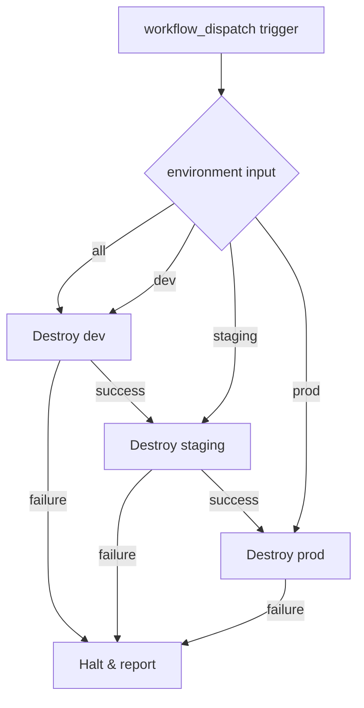

# Design Document: Terraform Teardown Workflow

## Overview

This feature introduces a GitHub Actions workflow (`.github/workflows/teardown-aws.yml`) that safely removes AWS infrastructure provisioned by Terraform. It mirrors the existing deploy workflow's authentication and backend configuration but replaces `terraform apply` with `terraform destroy`. The workflow supports targeting a single environment or tearing down all three (dev, staging, prod) in a controlled sequence.

The primary design goal is safety: destructive operations must be explicitly triggered, follow a predictable order, and halt immediately on failure.

## Architecture

The teardown workflow is a single GitHub Actions workflow file with no external application code dependencies. It reuses the same infrastructure-as-code patterns established by the deploy workflow.



### Design Decisions

1. **Sequential execution over parallel**: When tearing down all environments, the workflow processes them one at a time (dev -> staging -> prod). This avoids race conditions on shared resources and ensures any cross-environment dependency issues surface early in the least-critical environment.

2. **Fail-fast behavior**: If any environment's destroy fails, subsequent environments are skipped. This prevents cascading partial teardowns that would be difficult to diagnose.

3. **Single job with a matrix-like loop**: Rather than using GitHub Actions `strategy.matrix` (which runs jobs in parallel by default), the workflow uses a single job with a shell loop or sequential steps. This enforces strict ordering and enables fail-fast without additional job-level coordination.

4. **No plan step**: Unlike the deploy workflow, there is no `terraform plan` step before destroy. The `-auto-approve` flag is sufficient for a manually-triggered destructive workflow that already requires the operator to select the environment.

## Components and Interfaces

### Workflow File: `.github/workflows/teardown-aws.yml`

| Component | Description |
|-----------|-------------|
| Trigger | `workflow_dispatch` with `environment` choice input |
| Permissions | `id-token: write`, `contents: read` |
| Job: `teardown` | Single job on `ubuntu-latest` |
| Step: Checkout | `actions/checkout@v4` |
| Step: Configure AWS | `aws-actions/configure-aws-credentials@v4` with OIDC |
| Step: Setup Terraform | `hashicorp/setup-terraform@v3` |
| Step: Destroy loop | Iterates over target environments, runs init + destroy |

### Inputs

| Input | Type | Default | Options |
|-------|------|---------|---------|
| `environment` | choice | `"all"` | `all`, `dev`, `staging`, `prod` |

### Secrets and Variables (reused from deploy)

| Name | Type | Purpose |
|------|------|---------|
| `AWS_ROLE_ARN` | Secret | IAM role for OIDC assumption |
| `TF_STATE_BUCKET` | Secret | S3 bucket for remote state |
| `TF_STATE_DYNAMODB_TABLE` | Secret | DynamoDB table for state locking |
| `AWS_REGION` | Variable | AWS region (fallback: `us-east-1`) |

### Environment-to-Config Mapping

| Environment | Var-file path | State key |
|-------------|---------------|-----------|
| dev | `environments/dev.tfvars` | `dev/terraform.tfstate` |
| staging | `environments/staging.tfvars` | `staging/terraform.tfstate` |
| prod | `environments/prod.tfvars` | `prod/terraform.tfstate` |

## Data Models

This feature has no application data models. The "data" is Terraform remote state stored in S3, which is addressed by the backend-config parameters. Each environment's state is isolated by key prefix (`{env}/terraform.tfstate`).

### Workflow Input Schema

```yaml
inputs:
  environment:
    description: "Target environment to destroy"
    required: true
    default: "all"
    type: choice
    options:
      - all
      - dev
      - staging
      - prod
```

### Environment Iteration Logic

When `environment == "all"`, the workflow iterates over a fixed ordered list:

```
ENVIRONMENTS=("dev" "staging" "prod")
```

When `environment != "all"`, it processes only the selected value:

```
ENVIRONMENTS=("${{ github.event.inputs.environment }}")
```

## Error Handling

| Scenario | Behavior |
|----------|----------|
| OIDC auth failure | Job fails immediately, no Terraform commands run |
| `terraform init` failure | Loop exits, job fails, environment name reported |
| `terraform destroy` non-zero exit | Loop exits via `set -e`, job fails, subsequent environments skipped |
| Invalid environment input | Not possible — constrained by choice type |
| State file not found | Terraform init/destroy will report the error; job fails |

The shell script uses `set -e` to ensure any non-zero exit code halts execution. The failed environment name is written to `$GITHUB_STEP_SUMMARY` for visibility in the workflow run UI.

## Testing Strategy

### Why Property-Based Testing Does NOT Apply

This feature is a declarative GitHub Actions workflow YAML file — Infrastructure as Code. There is no application logic, no functions with inputs/outputs, and no code that benefits from randomized input testing. PBT is inappropriate for IaC per established testing guidelines.

### Recommended Testing Approach

| Test Type | What it Validates | Method |
|-----------|-------------------|--------|
| **YAML Lint** | Workflow file is syntactically valid YAML | `yamllint` or equivalent CI check |
| **Workflow Syntax Validation** | Valid GitHub Actions schema | `actionlint` static analysis tool |
| **Manual Smoke Test** | End-to-end workflow execution | Trigger workflow on a dev environment with minimal resources |
| **Code Review** | Correct secrets, backend-config values, ordering logic | Compare teardown workflow against deploy workflow side-by-side |

### Validation Checklist (manual review)

- [ ] Backend-config parameters match deploy workflow for the same environment
- [ ] OIDC configuration uses same action version and parameters as deploy
- [ ] Environment ordering is dev -> staging -> prod
- [ ] `-auto-approve` flag is present on `terraform destroy`
- [ ] Var-file paths match the pattern `environments/{env}.tfvars`
- [ ] Working directory is `terraform/aws` for all Terraform commands
- [ ] Fail-fast behavior halts on first non-zero exit
- [ ] Workflow name is "Teardown AWS Infrastructure"
- [ ] File is located at `.github/workflows/teardown-aws.yml`
